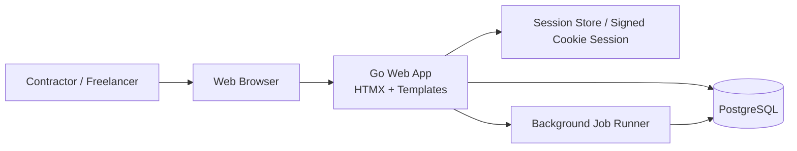
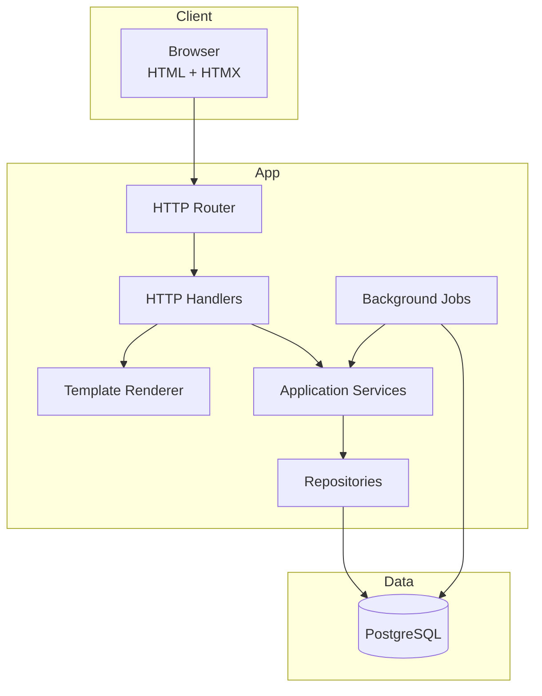
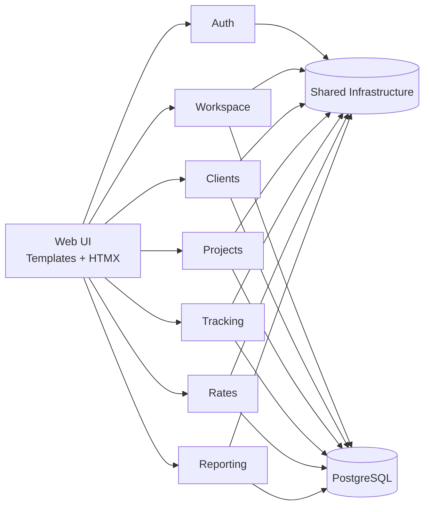
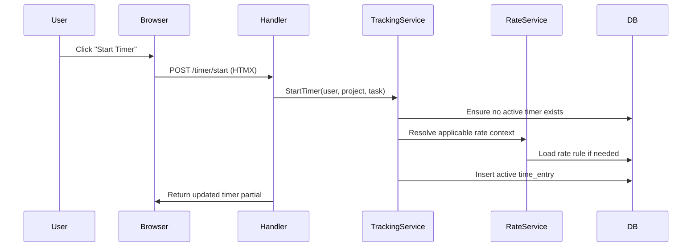
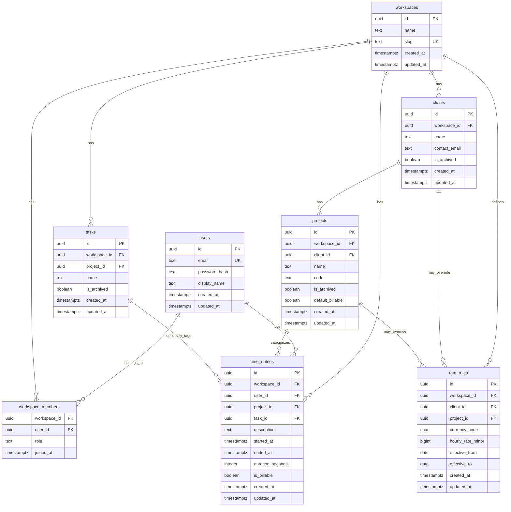
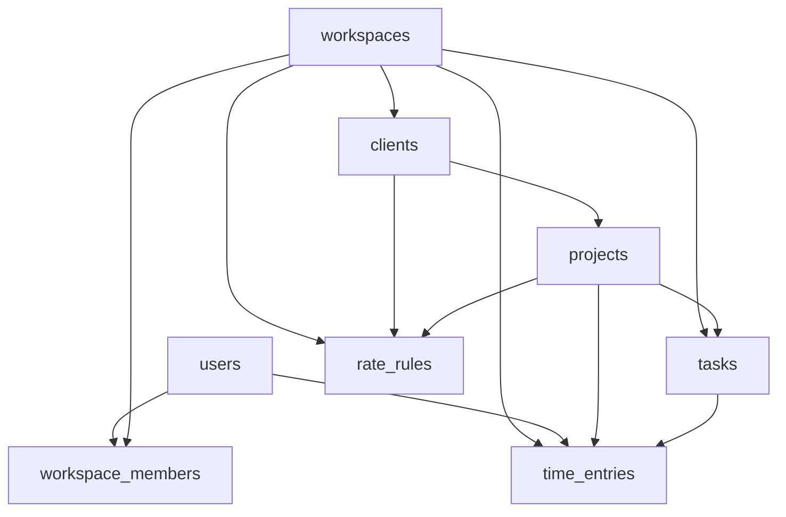
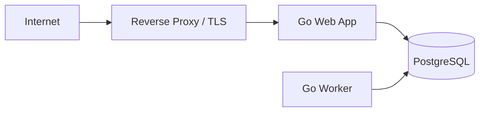

# Time Tracking Application — Software Design Document

## 1. Executive Summary

This document proposes the design for a **time tracking and billing application** for **contractors, freelancers, and small agencies**. The product allows users to:

- track time worked
- organize work by **client**, **project**, and optional **task**
- define **hourly billing rates**
- calculate billable value from tracked time
- review timesheets and reporting data
- support future invoice generation and team collaboration

The proposed stack is:

- **Backend:** Go
- **Server-side UI:** HTMX + Go HTML templates
- **Database:** PostgreSQL
- **Background jobs:** Go worker processes / scheduled jobs
- **Auth/session management:** secure cookie sessions or token-backed sessions
- **Deployment target:** Linux container or VPS/PaaS environment

The system is intentionally designed as a **modular monolith** first. This keeps the product simple to build, easy to reason about, and operationally lightweight while still giving clean boundaries for future expansion.

---

## 2. Product Vision

Build a lightweight but professional time tracking application that gives independent workers a cleaner alternative to spreadsheets and heavyweight enterprise PM tools.

The application should feel like:

- simple enough for a solo freelancer
- structured enough for contractors managing multiple clients
- extensible enough for future team/workspace support

---

## 3. Goals

### Primary Goals

- Allow users to log time quickly with minimal friction
- Associate time with **clients** and **projects**
- Support **hourly rates** that can vary by project or client
- Compute billable totals accurately
- Provide clear reporting by date range, client, and project
- Support manual time entry and active running timers
- Keep architecture easy to deploy and maintain

### Secondary Goals

- Support multi-user workspaces later without redesigning the whole data model
- Support invoice generation later
- Support approval workflows later
- Support exporting time and summaries to CSV/PDF later

### Non-Goals (Initial MVP)

- Full accounting system
- Payroll processing
- Complex enterprise permissions
- Real-time collaborative editing
- Native mobile app
- Offline-first sync engine

---

## 4. Users and Personas

### 4.1 Solo Freelancer

Needs to:

- start and stop timers
- log work for different clients
- set project rates
- know how much to bill

### 4.2 Independent Contractor

Needs to:

- track time across multiple concurrent projects
- distinguish billable vs non-billable hours
- review weekly/monthly totals
- export summaries for invoicing

### 4.3 Small Agency / Team Lead (Future)

Needs to:

- invite teammates
- assign work to projects
- define project-level rates
- review submitted timesheets

---

## 5. Assumptions

To keep the first version focused, this design assumes:

- each user belongs to at least one **workspace**
- a solo user gets a personal default workspace
- most tracked work belongs to a **project**
- each project belongs to exactly one **client**
- billing rates may change over time, so rates need **effective date ranges**
- billing uses money-safe integer storage (for example cents) rather than floating point
- the application is server-rendered first, using HTMX for interactivity instead of building a large SPA

---

## 6. Functional Requirements

### 6.1 Authentication and Accounts

- user can sign up and sign in
- user can sign out
- user can belong to one or more workspaces
- user can switch active workspace

### 6.2 Clients

- create client
- edit client
- archive client
- list clients per workspace

### 6.3 Projects

- create project under a client
- edit project
- archive project
- mark project as billable by default
- optionally associate default billing rate behavior

### 6.4 Tasks / Categories (Optional MVP, recommended)

- create reusable task labels within a workspace or project
- use tasks to categorize work like Development, Meetings, QA, Research

### 6.5 Time Entries

- start timer
- stop timer
- manually create entry with start/end
- edit existing entry
- mark entry as billable or non-billable
- attach description/notes
- associate entry with project and optional task
- prevent overlapping active time entries per user in the same workspace

### 6.6 Rates and Billing

- define default workspace billing rate
- optionally override rate at client level
- optionally override rate at project level
- preserve historical rate meaning using effective dates
- compute billable amount using the applicable rate at the time the work occurred

### 6.7 Reporting

- totals by day/week/month
- totals by client
- totals by project
- billable vs non-billable time
- estimated billed amount
- filter by date range and workspace

### 6.8 Exporting (Near-term extension)

- CSV export of time entries
- CSV export of summary reports

---

## 7. Non-Functional Requirements

### Performance

- dashboard and timesheet pages should feel fast under normal single-workspace usage
- common list and report pages should respond in under ~300–500 ms for typical small-business datasets

### Reliability

- timer stop/start actions must be transactional and safe
- no duplicate running timers per user/workspace
- billable calculations must be deterministic

### Security

- hashed passwords using Argon2 or bcrypt
- CSRF protection on mutating form actions
- secure session cookies
- row-level authorization enforced in application logic by workspace membership

### Maintainability

- modular monolith structure
- service boundaries around auth, tracking, clients/projects, reporting, rates
- SQL migrations versioned and repeatable

### Observability

- structured logs
- request tracing/correlation IDs
- metrics for request latency, DB latency, and failed timer operations

---

## 8. High-Level Architecture

The system will be implemented as a **server-rendered web application**.

HTMX is used to progressively enhance pages with partial updates such as:

- starting/stopping timers
- inline editing of entries
- filtering reports
- switching date views
- loading modal content

This avoids a large frontend build surface while still giving a responsive UX.

### 8.1 Architectural Style

- **Modular monolith**
- **Layered architecture inside modules**
- **PostgreSQL as the system of record**
- **HTML templates + HTMX** for the presentation layer
- **Background job runner** for recurring calculations and export generation

---

## 9. Architecture Diagrams

### 9.1 System Context Diagram



### 9.2 Container / Runtime Diagram



### 9.3 Internal Module Diagram



### 9.4 Request Flow for Starting a Timer



---

## 10. Module Design

### 10.1 Auth Module

Responsibilities:

- user registration and login
- password hashing and verification
- session creation and invalidation
- current user resolution

### 10.2 Workspace Module

Responsibilities:

- workspace creation
- membership and role handling
- active workspace switching
- authorization boundary root

### 10.3 Clients Module

Responsibilities:

- client CRUD
- client archival
- client-level metadata

### 10.4 Projects Module

Responsibilities:

- project CRUD
- project status/archival
- project ↔ client relationship
- project defaults for billing and tasking

### 10.5 Tracking Module

Responsibilities:

- time entry lifecycle
- running timer management
- overlap prevention
- duration calculations
- notes and tags

### 10.6 Rates Module

Responsibilities:

- rate hierarchy resolution
- rate history using effective date ranges
- billable amount calculation inputs

### 10.7 Reporting Module

Responsibilities:

- aggregate query generation
- dashboard totals
- date range filtering
- summary/export projections

---

## 11. Recommended Go Package Structure

```text
/cmd
  /web
  /worker
/internal
  /auth
    handler.go
    service.go
    repository.go
    model.go
  /workspace
  /clients
  /projects
  /tasks
  /tracking
  /rates
  /reporting
  /shared
    /db
    /http
    /templates
    /money
    /clock
    /authz
/migrations
/web
  /templates
  /static
```

### Notes

- `cmd/web` hosts the HTTP app
- `cmd/worker` hosts scheduled/export/background processes
- `internal/*` keeps domain/application code private to the module
- shared concerns like money, clock abstraction, authz helpers, and db helpers live under `/internal/shared`

---

## 12. Domain Model Overview

Core business entities:

- **User**
- **Workspace**
- **WorkspaceMember**
- **Client**
- **Project**
- **Task**
- **TimeEntry**
- **RateRule**

### Domain Rules

1. A workspace contains clients, projects, tasks, and time entries.
2. A client belongs to one workspace.
3. A project belongs to one client.
4. A time entry belongs to one workspace and one user.
5. A time entry should typically belong to one project.
6. A time entry can optionally belong to one task.
7. A user can have at most one running timer per workspace.
8. Billing rate resolution follows a precedence order.

### Billing Rate Precedence

Recommended precedence:

1. Project-specific rate
2. Client-specific rate
3. Workspace default rate
4. No rate / zero rate

This makes pricing flexible without denormalizing time entries.

---

## 13. Data Model and Normalization

This design aims for **Third Normal Form (3NF)** for transactional tables, while allowing reporting queries to use read-optimized SQL views or materialized views later if needed.

### 13.1 Why Normalize?

Normalization helps us avoid:

- repeated client data on every project row
- repeated project data on every time entry row
- rate duplication and update anomalies
- inconsistent client/project relationships

### 13.2 Normalization Targets

#### First Normal Form (1NF)

- atomic column values only
- no arrays for core relational references
- one time entry row per contiguous work period

#### Second Normal Form (2NF)

- no partial dependency on composite keys
- use surrogate IDs for major entities
- join tables only contain attributes that belong to the relationship

#### Third Normal Form (3NF)

- non-key columns depend only on the key
- client fields stay on `clients`, not repeated on `projects`
- project fields stay on `projects`, not repeated on `time_entries`
- rate rules stored separately rather than embedded in clients/projects/time entries as mutable defaults

### 13.3 Intentional Controlled Duplication

For correctness and auditability, some calculated values may optionally be captured at write time later, such as:

- effective hourly rate used at billing time
- computed billable amount snapshot during invoice generation

These belong in invoice/billing tables, not in the core normalized `time_entries` table.

---

## 14. Database Schema (Normalized)

### 14.1 Entity Relationship Diagram



---

## 15. Table-by-Table Design

### 15.1 `users`

Purpose:

- stores identity credentials and profile data

Important constraints:

- unique email
- password hash only, never plaintext

### 15.2 `workspaces`

Purpose:

- top-level boundary for tenant-like data partitioning

Why it matters:

- allows solo and team use cases
- provides a clean authz boundary

### 15.3 `workspace_members`

Purpose:

- many-to-many join between users and workspaces
- stores role within that workspace

Suggested roles:

- owner
- admin
- member

Composite PK recommendation:

- `(workspace_id, user_id)`

### 15.4 `clients`

Purpose:

- stores business customers for a workspace

Key rule:

- client belongs to one workspace only

### 15.5 `projects`

Purpose:

- stores units of work for a client

Key rules:

- project belongs to one client
- workspace_id repeated here intentionally for easier authorization and indexing, while still keeping client_id authoritative for the business relationship

Recommended invariant:

- project.workspace_id must match client.workspace_id

### 15.6 `tasks`

Purpose:

- optional category beneath a project or workspace

Design note:

- `project_id` may be nullable if you want workspace-level tasks
- if not nullable, tasks become strictly project-scoped

### 15.7 `time_entries`

Purpose:

- stores the actual tracked time

Key rules:

- one row per logged work interval
- `ended_at` nullable while timer is running
- `duration_seconds` can be stored for convenience/consistency and set when stopping timer

Recommended invariants:

- `ended_at >= started_at` when ended_at is not null
- `duration_seconds >= 0`
- only one active row (`ended_at is null`) per `(workspace_id, user_id)`

### 15.8 `rate_rules`

Purpose:

- stores billable rate history and override hierarchy

Design rationale:

Instead of putting a single mutable `hourly_rate` on workspaces, clients, and projects, we store rate rules separately with date windows. This supports:

- future rate changes
- historical correctness
- clear override behavior

Recommended patterns:

- workspace default rule: `client_id null`, `project_id null`
- client rule: `client_id set`, `project_id null`
- project rule: `project_id set`

Recommended invariant:

- project-specific rule should imply the project belongs to the same workspace

---

## 16. SQL-Oriented Schema Example



---

## 17. Proposed PostgreSQL Constraints and Indexes

### Constraints

- `users.email` unique
- `workspaces.slug` unique
- `workspace_members` primary key `(workspace_id, user_id)`
- foreign keys across all parent-child relationships
- check constraint: `ended_at IS NULL OR ended_at >= started_at`
- check constraint: `duration_seconds >= 0`
- check constraint: `hourly_rate_minor >= 0`

### Partial Unique Index

Prevent more than one running timer per user/workspace:

```sql
CREATE UNIQUE INDEX ux_time_entries_one_active_per_user_workspace
ON time_entries (workspace_id, user_id)
WHERE ended_at IS NULL;
```

### Reporting Indexes

```sql
CREATE INDEX ix_time_entries_workspace_started_at
ON time_entries (workspace_id, started_at DESC);

CREATE INDEX ix_time_entries_workspace_project_started_at
ON time_entries (workspace_id, project_id, started_at DESC);

CREATE INDEX ix_projects_workspace_client
ON projects (workspace_id, client_id);

CREATE INDEX ix_rate_rules_workspace_effective
ON rate_rules (workspace_id, effective_from, effective_to);
```

---

## 18. Rate Resolution Design

Rate resolution should be centralized in a `RateService`.

### Resolution Input

- workspace_id
- project_id
- time entry start date

### Resolution Logic

1. load project
2. find active project rate for date
3. if none, find active client rate for date
4. if none, find active workspace default rate for date
5. if none, return no rate

### Why Centralize This?

Because rate logic becomes tricky fast:

- multiple override levels
- rate history windows
- future invoice calculations
- potential custom rules later

This logic should not be duplicated in handlers or templates.

---

## 19. API / Route Design

Even with HTMX, route design should still be clean and explicit.

### HTML Page Routes

- `GET /login`
- `GET /dashboard`
- `GET /clients`
- `GET /projects`
- `GET /time`
- `GET /reports`

### HTMX Partial Routes

- `POST /timer/start`
- `POST /timer/stop`
- `POST /time-entries`
- `PATCH /time-entries/{id}`
- `DELETE /time-entries/{id}`
- `GET /reports/summary`
- `GET /dashboard/timer-widget`

### JSON Endpoints (Optional, limited)

A mostly server-rendered app can still expose selective JSON APIs for integrations/exporting later.

---

## 20. UI Architecture with HTMX

### Why HTMX Fits This Product

This application is form-heavy, CRUD-heavy, and interaction-driven. HTMX is a strong fit because:

- most UI interactions map to small partial refreshes
- tables, filters, and modals are easy to implement server-side
- the frontend remains lightweight
- backend developers can move quickly without building a large SPA state layer

### Good HTMX Use Cases Here

- inline entry edits
- timer start/stop button updates
- live totals widgets
- paginated entry lists
- report filter forms
- modal create/edit forms

### Where to Be Careful

- avoid extremely complex client-side state
- define clear partial templates
- keep validation responses predictable

---

## 21. Reporting Strategy

For MVP, reports can be generated directly from transactional tables using indexed aggregate queries.

### Example Report Types

- hours by day
- hours by week
- hours by client
- hours by project
- billable value by date range

### Later Scaling Option

If reporting grows heavy, introduce:

- SQL views
- materialized views
- summary tables refreshed by jobs

This preserves the normalized source-of-truth model while optimizing reads.

---

## 22. Security Design

### Authentication

- password-based login for MVP
- session cookie auth
- option to add OAuth later

### Authorization

All domain actions must verify that the current user belongs to the workspace owning the data.

Examples:

- cannot view another workspace’s clients
- cannot edit another workspace’s entries
- cannot start timer against another workspace’s project

### Web Security

- CSRF protection
- secure cookies
- SameSite configuration
- input validation and output escaping
- rate limiting on auth endpoints

---

## 23. Concurrency and Timer Integrity

Starting and stopping timers is one of the most important correctness areas.

### Timer Start Transaction

Within one DB transaction:

1. verify user membership in workspace
2. verify project belongs to workspace
3. ensure no active timer exists for user/workspace
4. insert new active time entry

### Timer Stop Transaction

Within one DB transaction:

1. locate active timer row for user/workspace
2. set `ended_at`
3. compute `duration_seconds`
4. persist updated row

### Why Transaction Boundaries Matter

They prevent:

- double-start races
- stale stop operations
- inconsistent duration calculations

---

## 24. Deployment Architecture

### MVP Deployment Option

- one Go web app container
- one PostgreSQL instance
- optional second Go worker container/process
- reverse proxy (Caddy, Nginx, or platform ingress)



### Why This Is Enough Initially

- simple operational model
- low infrastructure overhead
- easy backup and restore story
- straightforward local Docker Compose setup

---

## 25. Local Development Setup

Recommended local stack:

- Go
- PostgreSQL
- air or reflex for hot reload
- templ or standard html/template approach
- Tailwind CSS optional for styling
- Docker Compose for PostgreSQL and supporting services

Suggested dev services:

- app
- postgres
- mailpit (if email is added later)

---

## 26. Observability and Operations

### Logging

Use structured logs with fields such as:

- request_id
- user_id
- workspace_id
- route
- duration_ms
- error_code

### Metrics

Track:

- request counts
- latency percentiles
- DB query time
- active timer start failures
- report generation time

### Auditability

Later, add audit events for:

- rate changes
- deleted/archived projects
- manual edits to time entries

---

## 27. Future Evolution

### Short-Term Enhancements

- invoice generation
- PDF/CSV export
- recurring work templates
- reminders for running timers
- tags and richer filtering

### Medium-Term Enhancements

- team workspaces
- approvals and timesheet submission
- budgets and project caps
- client portal access

### Long-Term Enhancements

- external integrations (QuickBooks, Xero, Stripe)
- calendar integrations
- public API
- mobile app

---

## 28. Risks and Tradeoffs

### Tradeoff: HTMX vs SPA

**HTMX wins** for development speed and simplicity.

Risk:

- some highly interactive views may become template-heavy

Mitigation:

- keep UI components modular
- only introduce JS where it truly adds value

### Tradeoff: Modular Monolith vs Microservices

**Modular monolith wins** for MVP.

Risk:

- if boundaries are ignored, code can become tangled

Mitigation:

- enforce module ownership and repository boundaries

### Tradeoff: Normalized OLTP Schema vs Denormalized Reporting Tables

**Normalized schema wins** initially.

Risk:

- heavy reports can become complex later

Mitigation:

- add views/materialized views once reporting load justifies it

---

## 29. Recommended MVP Scope

### Include in MVP

- authentication
- workspace setup
- clients
- projects
- tasks/categories
- manual time entries
- running timer
- rate rules
- summary reporting

### Exclude from MVP

- invoices
- approvals
- multi-currency conversion
- expense tracking
- advanced role matrix
- public API

---

## 30. Final Recommendation

Build the product as a **Go + HTMX + PostgreSQL modular monolith** with a **normalized relational schema** and a **rate resolution service** that supports historical billing correctness.

This gives you:

- a pragmatic MVP path
- low frontend complexity
- strong data integrity
- room to grow into team/workspace and billing features later

The most important design decisions in this proposal are:

1. **workspace as the authorization boundary**
2. **project under client hierarchy**
3. **normalized transactional schema in 3NF**
4. **historical rate rules using effective dates**
5. **single active timer constraint enforced in PostgreSQL**
6. **HTMX-driven server-rendered UI for fast development**

---

## 31. Appendix: Suggested First Migrations

Recommended order:

1. `users`
2. `workspaces`
3. `workspace_members`
4. `clients`
5. `projects`
6. `tasks`
7. `time_entries`
8. `rate_rules`
9. indexes and partial unique constraints

---

## 32. Appendix: Example Bounded Contexts Summary

| Module | Owns | Key Responsibility |
|---|---|---|
| Auth | users, sessions | identity and login |
| Workspace | workspaces, workspace_members | tenant boundary and access |
| Clients | clients | customer management |
| Projects | projects, tasks | work structure |
| Tracking | time_entries | time capture lifecycle |
| Rates | rate_rules | billing rate history and resolution |
| Reporting | projections/views | totals, summaries, exports |

---

## 33. Appendix: Example Core Query Patterns

### Daily Summary

Aggregate `time_entries` by date for a workspace and date range.

### Client Summary

Join `time_entries -> projects -> clients`, grouped by client.

### Billable Value Summary

Aggregate tracked duration and multiply by resolved hourly rate or precomputed invoice snapshot later.

---

## 34. Open Questions for Next Iteration

These do not block the design, but they are good next decisions:

1. Should tasks be workspace-scoped, project-scoped, or both?
2. Should a time entry require a project, or allow client-only tracking?
3. Should rate rules support per-user overrides later?
4. Should reports calculate rate values live, or snapshot them during billing?
5. Should invoice generation become its own module after MVP?


---

## 35. Authorization (Stage 2 hardening)

Workspace is the sole authorization boundary. The following invariants are
contract, enforced by code rather than convention:

- **Typed request context**: every domain handler receives a
  `authz.WorkspaceContext{UserID, WorkspaceID, Role}` populated by the
  `RequireWorkspace` middleware. Handlers obtain it via
  `authz.MustFromContext(ctx)`. Reading `workspace_id` from form, query,
  path, or body input for authorization purposes is forbidden and
  enforced by a `go test` lint at
  `internal/shared/authz/handler_input_lint_test.go`.
- **Repository audit**: every public function whose signature accepts
  `workspaceID uuid.UUID` MUST issue SQL constrained by `workspace_id`.
  This is the canonical workspace-scope enforcement check, implemented as
  `internal/shared/authz/repo_audit_test.go`. Confirmed-safe exceptions
  (e.g. a same-transaction lookup that already verified scope) declare
  themselves with an inline `// authz:ok: <reason>` comment within five
  lines preceding the SQL literal.
- **Cross-workspace 404 contract**: cross-workspace access (and any "row
  not found" 404) is rendered through the shared
  `web/templates/errors/not_found.html` template via
  `sharedhttp.NotFound`. The body is byte-identical regardless of which
  resource was requested, preventing information disclosure via response
  differences.
- **Database-level project/client consistency**: migration 0012 adds a
  composite foreign key `projects (client_id, workspace_id) REFERENCES
  clients (id, workspace_id)` so service-layer bugs cannot produce
  inconsistent rows.
- **Per-domain authz integration tests**: each covered domain ships an
  `authz_test.go` that exercises every registered route as a non-member
  user, asserting HTTP 404 with no information disclosure. A
  route-coverage test in `internal/shared/http/route_coverage_test.go`
  fails the build if a new route is added without a corresponding test.
