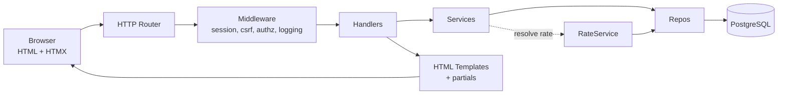
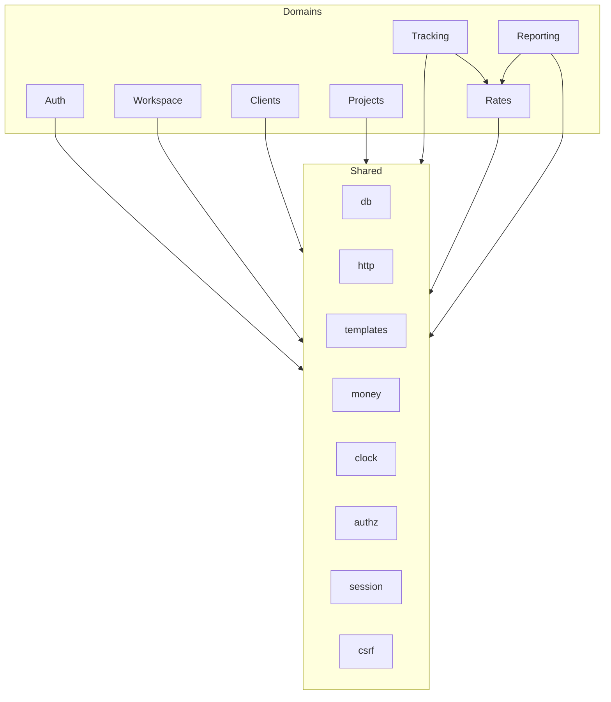
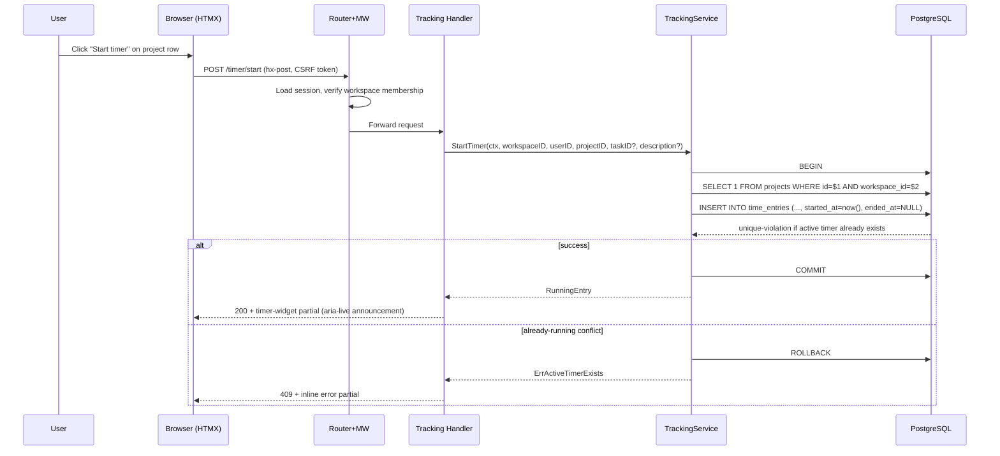
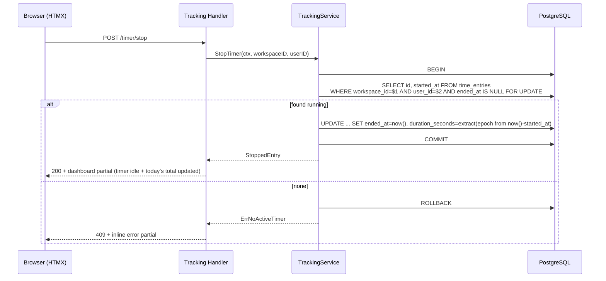
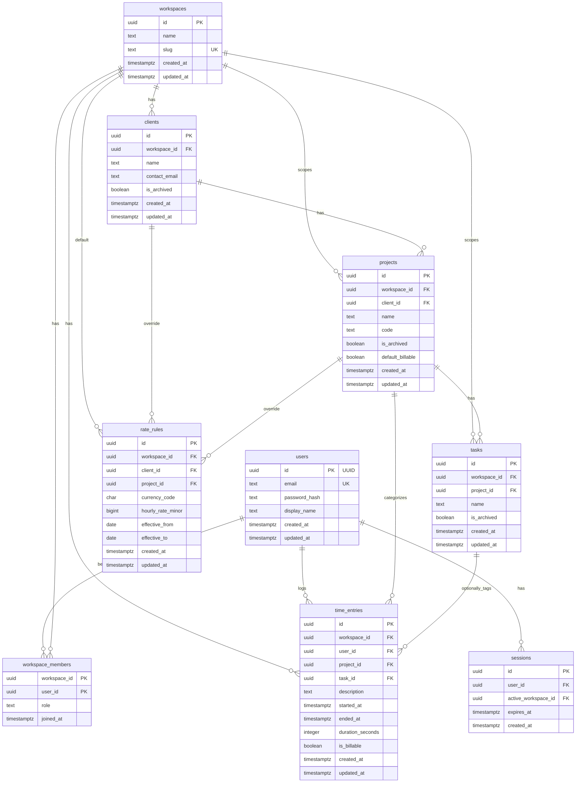
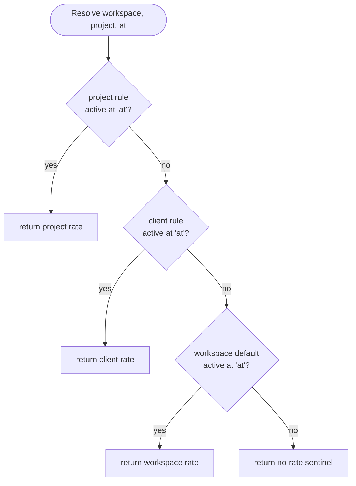

## Context

TimeTrak is pre-code. The repo contains a design doc (`docs/time_tracking_design_doc.md`), a UI style guide (`docs/time_trak_mvp_ui_style_guide.md`), and this OpenSpec scaffold. No Go source, no migrations, no templates, no accepted baseline in `openspec/specs/`. The product target is a single-user freelancer workflow first, structured so multi-member workspaces can land later without data-model churn. This design covers how to implement the seven MVP domains (`auth`, `workspace`, `clients`, `projects`, `tracking`, `rates`, `reporting`) as a Go + HTMX + PostgreSQL modular monolith.

Stakeholders / constraints:

- Binding: UUID PKs, `timestamptz`, money as integer minor units, 3NF transactional tables, workspace as authz boundary, rate precedence project → client → workspace default, WCAG 2.2 AA, server-rendered + HTMX, no SPA/ORM that fights HTMX, no generic SaaS visual language.
- The specs in this same change define behavior; this document describes the technical shape that will satisfy them.

## Goals / Non-Goals

**Goals:**

- Establish a modular monolith layout with clear domain boundaries and shared infrastructure.
- Land a normalized PostgreSQL schema that enforces the most important invariants in the database, not just in Go.
- Centralize rate resolution in one service with deterministic precedence and date-aware lookup.
- Ship a server-rendered UI with HTMX partials for the highest-frequency interactions (timer start/stop, entry edits, filters, pagination, modals) and preserve focus after swaps.
- Make the timer lifecycle transactional and race-safe.
- Meet WCAG 2.2 AA from day one, including a light/dark/system theme toggle that does not rely on color alone for status.

**Non-Goals:**

- Invoicing, CSV/PDF export, approvals, team invitations UX, multi-currency conversion, expense tracking, public API, OAuth/SSO, audit log, per-user rate overrides, rate snapshots on time entries, materialized reporting views.
- A SPA or rich client state layer.
- A generic marketing/landing visual language.

## Decisions

### D1. Modular monolith with per-domain internal packages

Chosen: one Go binary (`cmd/web`) plus optional `cmd/worker`, with `/internal/{auth,workspace,clients,projects,tracking,rates,reporting,shared}`. Each domain owns its handlers, service, repository, and models. Shared concerns (`db`, `http`, `templates`, `money`, `clock`, `authz`, `session`, `csrf`) live under `/internal/shared`.

Alternatives considered:

- Flat package structure: faster to start, but blurs domain ownership and makes enforcing workspace authz a review-by-review problem.
- Microservices: massive overkill for MVP; operationally heavy.

Rationale: per-domain packages let us enforce `workspace_id` as a required parameter in every repository method and give the post-MVP split paths (e.g., extracting reporting) a natural seam.

### D2. Workspace authorization enforced in repositories

Every repository method that reads or writes domain data MUST accept `workspaceID uuid.UUID` as a parameter (not derived from the row) and MUST include it in the `WHERE` clause. Handlers resolve the active workspace from the session and pass it down. A `shared/authz` helper verifies the current user is a member of that workspace before any domain call runs.

Alternative: row-level security (RLS) in PostgreSQL. Rejected for MVP because it complicates connection pooling and migrations; revisit once team features land.

### D3. PostgreSQL invariants in-database, not only in application code

- Partial unique index to enforce the single active timer rule:
  ```sql
  CREATE UNIQUE INDEX ux_time_entries_one_active_per_user_workspace
  ON time_entries (workspace_id, user_id)
  WHERE ended_at IS NULL;
  ```
- Check constraints: `ended_at IS NULL OR ended_at >= started_at`, `duration_seconds >= 0`, `hourly_rate_minor >= 0`.
- Foreign keys on every parent-child relationship.
- Application-level invariant (checked in service): `project.workspace_id = client.workspace_id`.

Rationale: defense in depth. Concurrent requests from two tabs cannot create two running timers; the database rejects the second insert.

### D4. Rate resolution centralized in `RateService.Resolve`

Single entry point: `Resolve(ctx, workspaceID, projectID, at time.Time) (RateResolution, error)`. It queries `rate_rules` in precedence order (project → client → workspace default) using the `effective_from`/`effective_to` window that contains `at`. Returns `(hourly_rate_minor, currency_code, source)` or a sentinel "no rate" result. Reporting and (future) invoicing both go through this same function.

Alternative: compute rate inline in handlers. Rejected — guarantees drift and duplicated bugs.

### D5. Server-rendered HTML with HTMX for partials

Full-page GETs render complete documents; mutations return either a full redirect or a partial template fragment the browser swaps in. Pages:

- `GET /login`, `POST /login`, `POST /logout`
- `GET /signup`, `POST /signup`
- `GET /dashboard` (running timer widget + today's summary)
- `GET /clients`, `GET /clients/{id}`, `POST /clients`, `PATCH /clients/{id}`, `POST /clients/{id}/archive`
- `GET /projects`, `GET /projects/{id}`, `POST /projects`, `PATCH /projects/{id}`, `POST /projects/{id}/archive`
- `GET /time` (entries list with filters)
- `POST /timer/start`, `POST /timer/stop`
- `POST /time-entries`, `PATCH /time-entries/{id}`, `DELETE /time-entries/{id}`
- `GET /reports` (date-range, client, project filters; summary panels)

HTMX targets: timer widget, entry row in the entries table, filter form results, pagination footer, modal bodies. Every HTMX swap response MUST set `HX-Trigger` for focus hints and include a stable `id` on the swapped node so assistive tech announcements are coherent.

Alternatives: a full SPA (rejected — violates stack constraints and inflates delivery cost); Turbo/Hotwire (similar tradeoffs to HTMX but less aligned with `docs/`).

### D6. Minimal custom JS, Alpine-style islands only if unavoidable

HTMX + a tiny bit of vanilla JS for theme toggle and focus management. No framework. The theme toggle writes `data-theme="light|dark|system"` to `<html>` and persists to `localStorage`; CSS variables drive colors.

### D7. Authentication and sessions

Email + password. Passwords hashed with Argon2id (fallback bcrypt if an Argon2 library is unavailable). Sessions: signed, HttpOnly, SameSite=Lax, Secure cookies holding a session ID; session state in PostgreSQL (`sessions` table, keyed by id, carrying user_id, expires_at, active_workspace_id). CSRF: double-submit cookie or synchronizer token pattern on all mutating forms. Auth endpoints rate-limited (per-IP token bucket in memory for MVP, redis-ready shape).

Alternative: JWT. Rejected — rotation and revocation are harder for MVP and we don't need stateless horizontal scale yet.

### D8. Workspace auto-provisioning on signup

When a user signs up, a default personal workspace is created in the same transaction and the user is added as `owner`. The session's `active_workspace_id` is set to that workspace. A workspace switcher in the header is shown only when membership count > 1 (hidden for solo users to reduce visual noise, per the UI style guide).

### D9. Time entries require a project in MVP

Simplifies the tracking flow and reporting queries. Tasks remain optional and project-scoped. Client-only tracking is a deferred feature.

### D10. Reports compute rates live

Reports call `RateService.Resolve` per entry (using `started_at`) and sum in Go. For MVP data volumes this is fine. When performance requires it, a later change can introduce a `time_entries.resolved_rate_minor` snapshot or materialized views.

### D11. Accessibility-by-default patterns

- Every form control has a visible `<label>` explicitly associated via `for`/`id`.
- Status (running, billable, archived) is conveyed by text + icon, never color alone.
- Focus ring visible in both themes with ≥3:1 contrast.
- Target size ≥24×24 CSS pixels; primary CTAs ≥44×44.
- HTMX swaps preserve or explicitly reset focus using `hx-on::after-swap` and `autofocus` on the right element.
- Tables use `<th scope>`, captions, and sortable columns expose `aria-sort`.
- Destructive actions require confirmation (`<dialog>` element, native) and announce via `aria-live`.

### D12. Schema migrations

Plain SQL migrations under `/migrations` using a lightweight runner (e.g., `golang-migrate` or `goose`). Forward-only for MVP with a documented rollback plan (drop in reverse order). Migration 0001 creates `users`, `sessions`, then subsequent migrations add `workspaces`, `workspace_members`, `clients`, `projects`, `tasks`, `time_entries`, `rate_rules`, indexes, constraints.

## Architecture Diagrams

### High-level component view



### Domain module layout



### Timer start request flow



### Timer stop request flow



### Schema (ERD)



### Rate resolution



## Risks / Trade-offs

- **[Risk] Two-tab double-start race** → DB partial unique index rejects the second insert; handler converts unique-violation into a user-facing 409 with inline message. Covered by an integration test that issues concurrent `POST /timer/start`.
- **[Risk] Rate rule date windows overlap or have gaps** → Validation on rate-rule create/edit rejects overlapping windows at the same level (workspace-default, per-client, per-project). Gaps are allowed and fall through to the next precedence tier.
- **[Risk] Workspace authz leak across handlers** → Every repository method takes `workspaceID` explicitly; a `shared/authz.RequireMember` middleware runs before any domain handler; repository tests assert that omitting `workspaceID` is a compile error (interface shape) or returns no rows.
- **[Risk] HTMX swap loses focus** → Define a standard `hx-on::after-swap` handler that restores focus to an element with `data-focus-after-swap`; tested with keyboard-only walk-through on timer start/stop, entry edit, and pagination.
- **[Risk] Live rate computation for reports becomes slow at scale** → Accept for MVP; monitor p95 report latency; post-MVP change introduces per-entry rate snapshot or materialized view.
- **[Risk] Template sprawl** → Catalog partials up front: `partials/timer_widget.html`, `partials/entry_row.html`, `partials/client_row.html`, `partials/project_row.html`, `partials/report_summary.html`, `partials/flash.html`, `partials/pagination.html`. New UI work must reuse or extend these, not duplicate markup.
- **[Risk] Accessibility regressions** → Every UI task group includes explicit accessibility validation (keyboard path, focus state, label association, contrast check, non-color status, target size). CI can later add axe-core / pa11y; for MVP, manual checklist on each PR.
- **[Trade-off] Tasks are project-scoped (not workspace-scoped)** → Simpler MVP; workspace-level tasks are a later change if the need arises.
- **[Trade-off] Sessions stored in PostgreSQL rather than Redis** → One less dependency; swap to Redis when horizontal scale requires it.
- **[Trade-off] Argon2id requires native lib; bcrypt is pure Go** → Prefer Argon2id if the chosen hash library is readily available; bcrypt is an acceptable MVP fallback.

## Migration Plan

1. Scaffold Go module, `cmd/web`, `internal/*`, `web/templates`, `web/static`, `migrations`.
2. Wire middleware chain: request ID, structured logging, panic recovery, session loader, CSRF, workspace context, authz.
3. Run migrations in order: `users`, `sessions`, `workspaces`, `workspace_members`, `clients`, `projects`, `tasks`, `time_entries`, `rate_rules`, indexes and check constraints.
4. Land domain modules in dependency order: auth → workspace → clients → projects → rates → tracking → reporting.
5. Land templates alongside each domain; keep `partials/` consistent.
6. Manual accessibility walk-through on every primary flow before the change is archived.
7. Rollback: drop database and re-run; since this is the bootstrap change with no prior baseline, there is no backward-compat requirement.

## Open Questions

1. Argon2id vs bcrypt — decide at first implementation task based on library availability in our Go dependency set.
2. HTML template engine: `html/template` stdlib vs `templ`. Default to stdlib for MVP; revisit if compile-time safety becomes the bottleneck.
3. Pagination style for entries list: cursor vs offset. Start with offset (simpler) for MVP; revisit if large datasets appear.
4. Do we ship a sample seed for local development? Recommended: yes, a `dev-seed` target that creates a demo user, workspace, a client, a project, a workspace-default rate, and a handful of historical entries so the reports page is not empty on first run.
