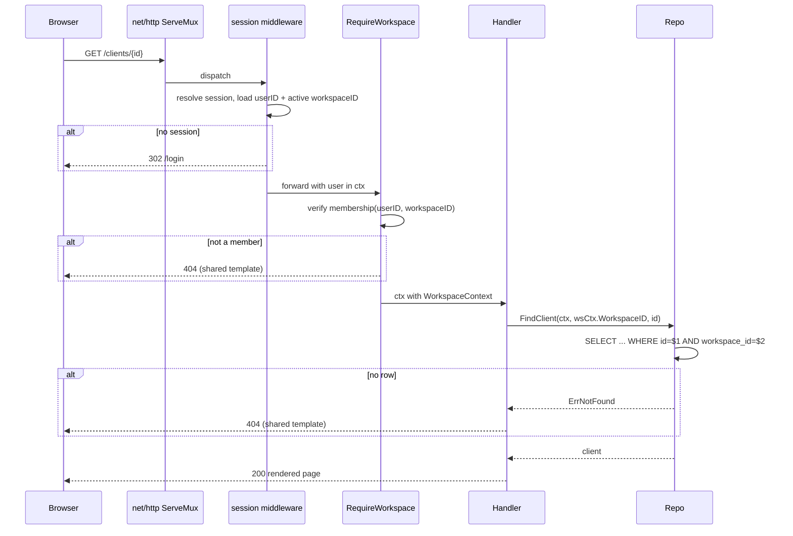
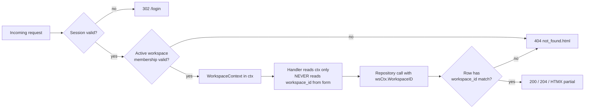

## Context

TimeTrak's MVP established workspace as the sole authorization boundary and landed three foundational invariants:
1. Every repository method takes `workspace_id` explicitly and includes it in the `WHERE` clause.
2. Cross-workspace access returns HTTP 404 (never 403, never 400), with no information disclosure about resource existence.
3. The active-timer partial unique index `ux_time_entries_one_active_per_user_workspace` is scoped to `(workspace_id, user_id)`.

These are upheld today by convention and reviewer discipline. There is no typed guardrail preventing a future handler from reading `workspace_id` from form input, no scripted audit over repository SQL strings, and no exhaustive integration test that attempts cross-workspace access against every mutating handler. Stage 2 promotes these invariants from convention to enforced contract.

The stack is Go + stdlib `net/http` (method+path patterns), `html/template` with HTMX partial swaps, and PostgreSQL via `pgx/v5`. Sessions carry the active workspace; handlers currently read it via a session helper. Request context (`context.Context`) is the natural carrier for an authenticated principal.

## Goals / Non-Goals

**Goals**
- Make it mechanically hard for a handler to operate without a verified active workspace.
- Provide a reproducible, scripted check that every repository method constrains its SQL by `workspace_id`.
- Give every handler family (clients, projects, tracking, rates, reporting) an exhaustive cross-workspace denial test.
- Close the `projects.workspace_id` ↔ `projects.client_id` consistency gap at the database layer.
- Document the authorization contract in `openspec/specs/workspace/spec.md` with testable scenarios.

**Non-Goals**
- Role-based authorization differences between `owner`/`admin`/`member` (deferred to Stage 3 team features).
- Audit logging of denied requests (separate observability change).
- Rewriting the session or auth layers.
- Any UI visual refresh beyond error-page copy consistency.
- Rate-limit tuning on auth endpoints.

## Decisions

### Decision 1: Typed `WorkspaceContext` carried in `context.Context`

Introduce a small, typed principal:

```go
// internal/shared/authz/workspace_context.go
type WorkspaceContext struct {
    UserID      uuid.UUID
    WorkspaceID uuid.UUID
    Role        string // "owner" | "admin" | "member"
}
```

A single middleware, `RequireWorkspace`, resolves it once from the session, verifies membership, and stashes it under an unexported key. Handlers read it via a typed accessor:

```go
func FromContext(ctx context.Context) (WorkspaceContext, bool)
func MustFromContext(ctx context.Context) WorkspaceContext // panics if missing — caller is protected by middleware
```

**Why**: The unexported key prevents accidental overwrites; the typed accessor means handlers cannot forget to validate workspace membership because there is no code path into the handler that skips the middleware. Handlers never read `workspace_id` from form/query/body — that value is untrusted input.

**Alternatives considered**:
- *Pass `workspaceID` as a handler parameter*: Rejected. Go's `http.Handler` signature is fixed; wrapping every handler to pull from context is strictly simpler than inventing a new signature.
- *Store on `*http.Request` via `WithContext`*: This is the chosen implementation. The decision above is about the type, not the carrier.

### Decision 2: Repository audit as a `go test`-runnable check

Add `internal/shared/authz/audit_test.go` that walks `internal/*/repo*.go`, parses SQL strings (heuristically), and asserts that every method accepting a `workspaceID uuid.UUID` parameter contains the substring `workspace_id` in its query. False positives are acceptable — the test surfaces gaps, and a developer adds an inline `//authz:ok: <reason>` comment to silence a confirmed-safe exception.

**Why**: A runtime middleware cannot catch a missing WHERE clause; only static inspection can. A Go test is cheap, runs in CI without new tooling, and produces actionable output (file + method + query).

**Alternatives considered**:
- *A full SQL parser*: Over-engineered for Stage 2. The substring check + allowlist comments is sufficient for a codebase where every query is hand-written and reviewed.
- *External linter (`sqlc`, `semgrep`)*: New dependency, new CI surface area. Rejected for MVP-mindedness.

### Decision 3: Cross-workspace integration test matrix via table-driven tests per domain

Each domain package gains an `authz_test.go` with a single table driving one test per handler. Each row specifies: method, path template, HTTP body (if any), and the expected outcome (must be 404 when the resource belongs to another workspace).

**Why**: One test file per domain keeps the matrix close to the handlers being tested and avoids a central authz test that becomes stale. Table-driven form means adding a new handler forces the author to add an authz row (enforceable by a test that counts registered routes against table rows).

### Decision 4: Database-level `projects.workspace_id` ↔ `projects.client_id` consistency

Today, `projects.client_id` has a foreign key to `clients(id)`, and `projects.workspace_id` is validated by service logic. Add a composite foreign key so inconsistency becomes unrepresentable:

```sql
-- migrations/NNNN_projects_workspace_client_consistency.up.sql
ALTER TABLE clients
  ADD CONSTRAINT clients_id_workspace_uniq UNIQUE (id, workspace_id);

ALTER TABLE projects
  ADD CONSTRAINT projects_client_workspace_fk
  FOREIGN KEY (client_id, workspace_id)
  REFERENCES clients (id, workspace_id);
```

Before adding the constraint, the migration runs a consistency check and aborts with a clear error if any `projects.workspace_id` disagrees with its client's `workspace_id`. (Expected rows: zero, but the check is cheap insurance.)

**Why**: The composite FK makes the invariant a database property, not a service property. Any bug in service code that attempts to create an inconsistent row fails at `INSERT` time with a referential integrity error, not silently.

**Alternatives considered**:
- *Trigger-based validation*: Works but is harder to reason about and less discoverable than a foreign key. Rejected.
- *Leave service-layer only*: The whole point of this change is to stop relying on service discipline for invariants that can be enforced by Postgres.

### Decision 5: 404 response body is a shared, content-free template

Cross-workspace 404s MUST render an identical body to "resource truly does not exist" 404s. Standardize on a single `web/templates/errors/not_found.html` partial that never names the resource and never echoes identifiers from the URL. This prevents a resource-existence oracle via response-body differences.

**Why**: Information disclosure via error pages is the most common way 404-vs-403 confusion leaks data. A shared template removes the possibility of handler-specific copy drift.

## Request Flow



## Handler Contract (after this change)



## Risks / Trade-offs

- **[Risk] Handler signature churn touches every domain package** → Mitigation: the typed accessor is backwards-compatible with the existing session helper during rollout; convert domains one at a time and remove the old helper once all call sites are migrated. The PR is still one change, but the internal sequencing is domain-by-domain.
- **[Risk] The composite foreign key migration fails on a dirty dataset** → Mitigation: the up migration pre-checks consistency and refuses to apply with a clear error. The down migration drops the constraint and the `clients_id_workspace_uniq` unique index cleanly.
- **[Risk] The scripted repository audit over-triggers on methods that legitimately do not need `workspace_id` (e.g., a session lookup)** → Mitigation: the audit key is "method accepts `workspaceID`", not "method exists", so session/auth repositories are naturally excluded. Genuine exceptions use an inline `//authz:ok: <reason>` comment.
- **[Trade-off] Exhaustive per-handler authz tests add ~30 test cases** → Accepted. They run fast (each is a single HTTP round trip against a truncated test DB), and they are the only way to make "every handler returns 404 cross-workspace" a verifiable claim rather than an aspiration.
- **[Risk] Shared 404 template reduces diagnostic detail in logs** → Mitigation: The response body is content-free, but server-side logs record the handler, the requested workspace, and the actual workspace so operators retain full context.

## Migration Plan

1. Land the `WorkspaceContext` type, middleware, and accessor behind the existing session plumbing (non-breaking).
2. Convert handlers domain-by-domain in this order: `clients` → `projects` → `tracking` → `rates` → `reporting`. Each conversion lands the per-domain authz test table alongside.
3. Land the repository audit test; fix any findings within this change.
4. Land the shared 404 template and route all cross-workspace 404s through it.
5. Land the `projects`/`clients` composite FK migration. Verify `make dev-seed` and `make migrate-redo` succeed locally.
6. Update `openspec/specs/workspace/spec.md` and domain specs via the delta specs in this change.

**Rollback**: Revert the PR. The composite FK migration has a clean down migration. No data migration is required (the FK is a constraint, not a column change).

## Open Questions

- Should `WorkspaceContext.Role` be surfaced to handlers now, or deferred until role-based features land? *Current answer: include the field in the type so handlers can depend on it, but do not branch on it in this change.*
- Should the repository audit be wired into `make lint` as well as `make test`? *Current answer: `make test` only for Stage 2; promote to a dedicated `make audit` target when the check grows.*
