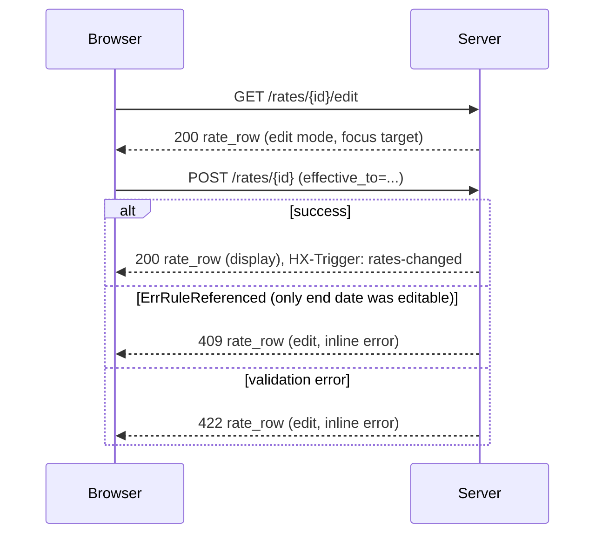

## Context

The `/rates` page is the only major management view still using pure POST/redirect. Other domain pages (clients, projects, entries) already use the established pattern:

1. A table row partial that can render in display or edit mode.
2. `GET /.../{id}/edit` and `GET /.../{id}/row` endpoints that return partial HTML.
3. Inline forms targeting the row with `hx-swap="outerHTML"`.
4. An HX-Trigger peer-refresh event emitted on successful writes.
5. `data-focus-after-swap` to keep keyboard focus sensible across swaps.

Applying the same pattern to rates removes an odd-one-out, keeps scroll/focus on edit, and produces a reusable `rate_row` partial usable later by reporting and invoicing views.

Constraints carried over from the existing rates service (unchanged by this design):

- `effective_from`, `currency_code`, `hourly_rate_minor`, scope columns are immutable once any entry references the rule (`ErrRuleReferenced`). Only `effective_to` may be extended.
- Overlap windows are rejected at the same precedence level.
- Money stays as integer minor units; UI parses/displays via `formatMinor`.
- Workspace authorization is enforced by the service layer on every call.

## Goals / Non-Goals

**Goals:**
- Turn the rate rule list into a row-level HTMX component consistent with clients/projects.
- Allow inline edit of a rule's `effective_to` without a full page reload.
- Keep an accessible, functional no-JS fallback (the page must still work with HTMX disabled).
- Emit `rates-changed` so future listeners (reporting summary, dashboard) can refresh without polling.
- Preserve every existing validation + historical-safety rule in the rates service.

**Non-Goals:**
- Changing rate storage, resolution, or precedence.
- Bulk edit, CSV import, or effective-date timeline UI.
- Subscribing any existing view to `rates-changed` — only the emitter is in scope.
- Introducing a modal/dialog component; delete confirmation uses `hx-confirm` to match clients/projects.

## Decisions

### 1. Partial inventory

Three new partials under `web/templates/partials/`:

- `rate_row.html` — renders one `<tr>` in display or edit mode. Shape: `{ Rule, Edit, Error, CSRFToken }`. Row id is `rate-{{.Rule.ID}}` so it can be the swap target.
- `rate_form.html` — renders the "New rate rule" card with `{ Form, Clients, Projects, CSRFToken }`. Targets `#rate-form` for re-render on validation errors; on success the handler returns `rates_table` and a fresh `rate_form` via an `hx-swap-oob` wrapper.
- `rates_table.html` — renders the whole `<tbody id="rates-tbody">` plus a fallback empty state. Used to re-render after create/delete when the number of rows changes.

This three-partial split mirrors `client_row` / `project_row` plus the pagination partial; it is the minimum needed to cover row-level edits and full-table mutations.

### 2. Routes

Additions:

- `GET /rates/{id}/edit` → returns `rate_row` with `Edit: true`.
- `GET /rates/{id}/row` → returns `rate_row` with `Edit: false`. Used by Cancel.

Existing routes gain HX-aware responses:

- `POST /rates`:
  - HX request + success → 200 with `rates_table` target `#rates-tbody` plus OOB `rate_form` reset; `HX-Trigger: rates-changed`.
  - HX request + validation error → 422 with `rate_form` re-rendered (error adjacent to offending field, `aria-describedby`).
  - Non-HX → existing 303 redirect to `/rates` preserved.
- `POST /rates/{id}`:
  - HX success → 200 with `rate_row` (display mode); `HX-Trigger: rates-changed`.
  - HX + `ErrRuleReferenced` for disallowed mutation → 409 with `rate_row` in edit mode including inline error (only `effective_to` was editable anyway).
  - HX + `ErrOverlap`/validation → 422 with `rate_row` in edit mode + error.
  - Non-HX → existing 303.
- `POST /rates/{id}/delete`:
  - HX success → 200 with `rates_table` target `#rates-tbody`; `HX-Trigger: rates-changed`.
  - HX + `ErrRuleReferenced` → 409 with `rate_row` re-rendered in display mode plus an inline error above it (the error lives in the row, not a global flash), keeping referenced-count copy.
  - Non-HX → existing 303 with full page re-render.

`HX-Request` header is the discriminator; no separate endpoints.

### 3. Scope-toggle without `onchange` inline JS

The current form uses inline `onchange="..."` to show/hide the client/project selects. Replace with either:

- (a) a tiny progressive-enhancement block in `app.js` that listens for `change` on `[data-scope-select]` and toggles `[data-scope-target]` via `hidden`, or
- (b) an HTMX-driven `hx-get="/rates/form?scope=…"` that re-renders the relevant field group.

**Chosen: (a).** Rationale: the scope toggle is a pure client-side concern with no server data dependency — round-tripping for it would be a regression in perceived latency and would burn requests during form fill-in. A ~10-line delegated listener stays well under the "minimal custom JS" budget and is consistent with the existing focus helper in `app.js`. No-JS fallback: render all three field groups visible (not `hidden`); server still uses `scope` to decide which fields to persist.

### 4. Focus handling

- After an edit starts (`GET /rates/{id}/edit`), the `Effective to` input carries `data-focus-after-swap`.
- After a successful edit (`POST /rates/{id}`), the "Edit end date" disclosure button within the refreshed `rate_row` carries `data-focus-after-swap` so keyboard users return to a stable anchor.
- After a successful create, the OOB-refreshed `rate_form`'s scope select gets `data-focus-after-swap`.
- After a successful delete, the focus target is the "New rate rule" form's scope select (row no longer exists).

### 5. `HX-Trigger: rates-changed` emission

Added to the shared HX response helper (`internal/shared/http`) if one exists, otherwise set explicitly in the rates handler. Event name chosen for symmetry with `entries-changed`, `timer-changed`, `clients-changed`, `projects-changed`. No current listener is being wired up — this is the producer half of the contract.

### 6. Error rendering

Every error stays inline in the partial that owns the offending input, associated via `aria-describedby`, with a `role="alert"` and `aria-live="assertive"` container. Color is never the sole signal (already true of the current implementation; preserved).

### Request flow (edit end date)

## Risks / Trade-offs

- **[Risk] HTMX partial path drifts from full-page path.** → Mitigation: both paths go through the same `parseInput` + service call; only the response writer differs. An integration test covers both branches for create and delete.
- **[Risk] Hidden immutable fields on edit row could be tampered with.** → Mitigation: the service rejects any non-`effective_to` change on referenced rules (`ErrRuleReferenced`) regardless of form input — the hidden fields are a convenience, not a trust boundary.
- **[Risk] No-JS users lose the scope-toggle convenience.** → Mitigation: render all three scope field groups visible when JS is off; server validates `scope` and ignores irrelevant selects. Acceptable because the form still works and the page re-renders on error.
- **[Trade-off] `hx-confirm` uses the native `confirm()` dialog.** → Rationale: matches clients/projects; accessibility-acceptable for MVP. A dialog-based flow using `partials/confirm_dialog.html` is a future standardization change, not this one.
- **[Trade-off] Emitting `rates-changed` without a subscriber is dead weight today.** → Accepted: producing the event now lets reporting/dashboard subscribe in a small follow-up without revisiting rates handlers.

## Migration Plan

Purely additive on the UI/HTTP layer. No DB migrations. Rollout:

1. Ship partials + handler branches behind normal deploy; non-HX path remains identical, so there is zero risk for users with JS disabled or browsers that don't load HTMX.
2. Smoke-test keyboard-only edit + delete flows.
3. No rollback plan needed beyond a standard revert — no data shape change.
