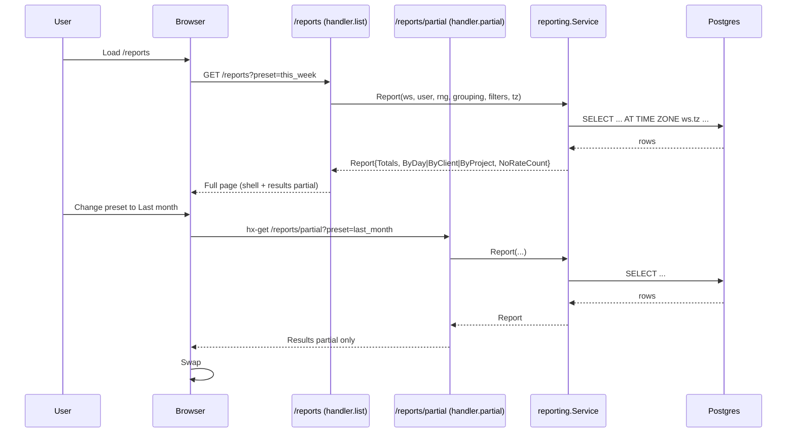
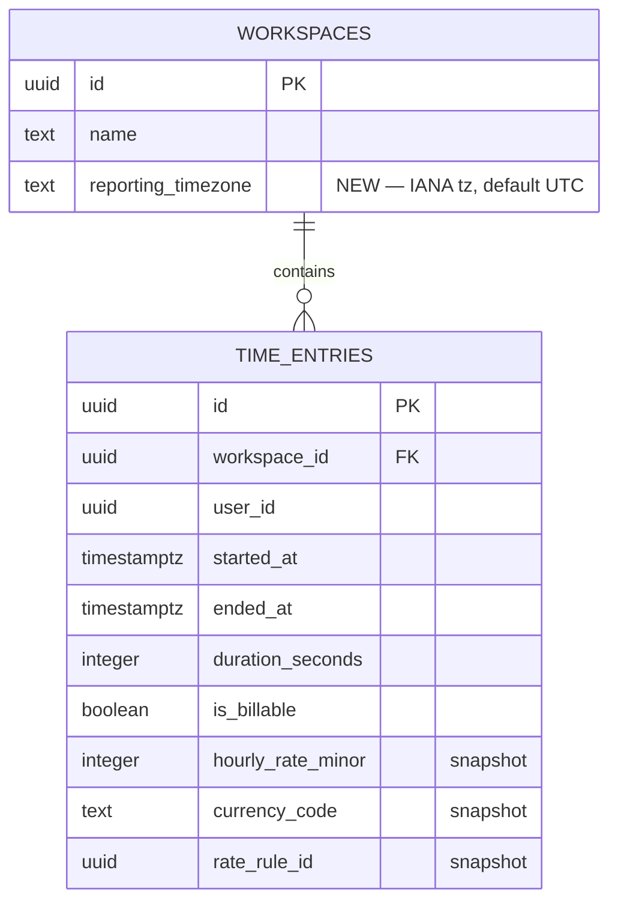

## Context

Stage 2 already made reporting snapshot-only for closed entries (archived change `2026-04-20-tighten-reporting-snapshot-only`). That locked historical totals against retroactive rate-rule edits. Correctness gaps that remain:

1. **Day-boundary bucketing is UTC-only.** `Report` compares `started_at::date` to a `time.Time` range built from `time.Now().UTC()`. For any workspace not in UTC, the day a user sees in their timer differs from the day reporting counts — by up to ±14 hours at extreme tz offsets, and an hour twice a year at DST flips.
2. **Filters are applied in Go, not SQL.** `handler.list` runs the full `Report` then strips rows in-memory. `TotalsBlock`, `NoRateCount`, and `ByDay` never observe `client_id` / `project_id`.
3. **No billable toggle.** The UI shows billable and non-billable side-by-side but gives no way to slice by billability. Users asking "how much did I bill this month?" must mentally subtract.
4. **No grand-total currency block.** Users with multi-currency clients see amounts per row but no summed total per currency.
5. **Inconsistent empty states.** Three separate `{{if not .ByX}}` branches; only one has `aria-live`.
6. **Full-page reload on every filter change.** The form is plain GET, defeating the HTMX conventions used elsewhere in the app.

Constraints: server-rendered Go templates + HTMX; stdlib `net/http`; `pgx`; integer minor units; workspace-scoped auth with 404 cross-workspace; snapshot-only read path; WCAG 2.2 AA.

## Goals / Non-Goals

**Goals:**
- Report bucketing matches the workspace-local wall clock, including across DST transitions.
- Every filter (`from`, `to`, `client_id`, `project_id`, `billable`) narrows at the SQL layer so `Totals`, `NoRateCount`, and every grouping agree.
- A grand-total per-currency block appears above the table when the range contains entries in one or more currencies.
- Changing any filter triggers an HTMX partial swap; focus stays on the changed control.
- Empty / loading / error states share one accessible partial.
- Zero reintroduction of `rates.Service.Resolve` on the read path; enforced by a package-import test.

**Non-Goals:**
- CSV / Excel / PDF export.
- Saved or named report presets beyond the existing preset dropdown.
- Shared / public report links.
- Per-user (vs per-workspace) reporting timezone (Stage 3).
- Cross-workspace roll-ups.
- Any write path through reporting.
- Changing the tracking domain's snapshot-at-stop behavior.

## Decisions

### 1. Workspace-local day bucketing via `AT TIME ZONE`

Add `workspaces.reporting_timezone` (IANA name, `NOT NULL DEFAULT 'UTC'`). Every SQL aggregation that buckets by day computes:

```sql
(te.started_at AT TIME ZONE w.reporting_timezone)::date AS d
```

The date-range filter compares the same expression against the incoming `from`/`to` dates (which are naive dates in the workspace's local tz):

```sql
WHERE (te.started_at AT TIME ZONE w.reporting_timezone)::date
      BETWEEN $3 AND $4
```

**Alternative considered:** Convert the incoming range to a UTC `timestamptz` window at the handler and compare raw `started_at`. Rejected — it works for bucketing by day inside a single tz but falls apart at DST transitions where a local day is 23 or 25 hours long, and complicates ISO-week rollups. `AT TIME ZONE` delegates the correctness to Postgres, which is the right system.

**Index implication:** The existing index is `time_entries(workspace_id, started_at)`. The planner cannot use it for a predicate on `(started_at AT TIME ZONE x)::date`. Mitigation: keep the index and add a redundant inclusive `started_at` bound in the WHERE clause:

```sql
WHERE te.workspace_id = $1
  AND te.started_at >= $3::timestamptz - interval '1 day'
  AND te.started_at <  $4::timestamptz + interval '2 days'
  AND (te.started_at AT TIME ZONE w.reporting_timezone)::date BETWEEN $3 AND $4
```

The outer bound is a superset that the index serves cheaply; the inner predicate filters the ~3-day envelope down to the correct local-date window. Verified with `EXPLAIN ANALYZE` on dev-seed before merge.

**Measured plans (2026-04-20, dev-seed inflated to 202,005 rows, ~28,910 rows in a 4-month range, `ANALYZE time_entries` fresh, UTC workspace, single user/project):**

| Query | Exec time | Buffers (all `shared hit`) | Plan on `time_entries` |
|---|---|---|---|
| Totals | 26.5 ms | 677 | Bitmap Index Scan on `ix_time_entries_workspace_started_desc` |
| Day grouping | 27.2 ms | 677 | Bitmap Index Scan on `ix_time_entries_workspace_started_desc` |
| Client grouping | 30.8 ms | 675 | Bitmap Index Scan on `ix_time_entries_workspace_started_desc` |
| Project grouping + `billable=yes` | 36.8 ms | 675 | Bitmap Index Scan on `ix_time_entries_workspace_started_desc` |

The raw-`started_at` envelope is the `Index Cond` in every plan; the tz-wrapped predicate `(started_at AT TIME ZONE w.reporting_timezone)::date BETWEEN …` is applied as a Nested Loop `Join Filter` that removed 535 rows out of 28,910 — i.e. the ±1-day padding at the envelope edges, exactly as designed. `workspaces`, `projects`, `clients` join via hash on ≤70-row tables. No sequential scan on `time_entries` at this volume. Recheck the plan with representative multi-project data if a workspace grows past ~10 projects or ~1M entries.

### 2. Single parameterized SQL builder for all scopes

Collapse the three `groupBy*` functions and `estimateScoped` into one query builder that accepts a `reportQuery` struct (workspaceID, userID, from, to, tz, grouping, clientID, projectID, billable). The builder emits the same WHERE skeleton for every query — totals, per-currency amount, day/client/project buckets — so a filter added here applies uniformly.

**Alternative considered:** Keep the three functions and duplicate the filter predicates. Rejected — duplication is how we got into the current inconsistent state.

### 3. Billable filter tri-state

`billable` query param: `""` (default, all), `"yes"`, `"no"`. Added to the WHERE skeleton as `AND (... = true/false)` when set. `NoRateCount` is always counted over the same slice, so passing `billable=no` yields `NoRateCount = 0` by construction.

### 4. Grand-total per-currency block

`TotalsBlock.EstimatedByCurrency` already exists. Template changes only: render a small `<dl>` list ordered by currency code (ascending) above the grouping table when `len(EstimatedByCurrency) > 0`. When the range contains entries in multiple currencies, list each separately — never sum across currencies.

### 5. HTMX partial endpoint

New route `GET /reports/partial` returns the results fragment only. The filter form uses `hx-get="/reports/partial" hx-target="#report-results" hx-push-url="true" hx-trigger="change, submit"`. The full page `/reports` continues to return the shell + the partial for deep-linking and no-JS. The partial endpoint reuses the handler's parsing + scoping logic via a shared helper.

Focus handling: each filter control carries `data-focus-after-swap` tied to its own ID; `app.js` already focuses the matching element on `htmx:afterSwap`. The change form does not re-render the controls, only the results region — so focus simply stays where it was on most swaps. Preset changes still submit, and the preset `<select>` is the focused element afterward.

### 6. Empty / loading / error unification

One partial, `partials/report_empty.html`, renders the message with `role="status" aria-live="polite"`. It is included from each grouping branch when the result set is empty. A single `data-hx-indicator="#report-results"` hook on the form shows a discreet "Loading…" overlay via an existing spinner partial (add one if absent — track in tasks). Server errors render a dedicated error partial with `role="alert"`.

### 7. Structural snapshot-only test

Add `internal/reporting/structure_test.go` that parses the package's read-path files (`service.go`, `handler.go`, and the new partial file) with `go/parser` and asserts `timetrak/internal/rates` does not appear in any `import` block. Complements the existing runtime test.

## Request flows



## Schema delta



## Risks / Trade-offs

- **[Risk] `AT TIME ZONE` defeats the `(workspace_id, started_at)` index.** → Mitigation: dual-bound the WHERE (raw `started_at` envelope + tz-converted date predicate); `EXPLAIN ANALYZE` gate before merge.
- **[Risk] Invalid tz in `reporting_timezone` crashes queries.** → Mitigation: validate at write time (settings form) against `pg_timezone_names`; CHECK enforces non-empty; migration defaults to `'UTC'`.
- **[Risk] HTMX partial endpoint duplicates query parsing and drifts from the full-page path.** → Mitigation: extract one `parseFilters(r)` and one `render(w, r, view)` helper; both routes call them. Integration test asserts identical rendered HTML for the partial slot between the two routes given the same query string.
- **[Risk] Multi-currency grand total could be misread as a sum.** → Mitigation: render each currency on its own row under a "Estimated billable" heading with currency code visible; no totals row across currencies.
- **[Risk] DST transitions produce a 23-hour or 25-hour day.** → Mitigation: integration test fixtures for `America/New_York` spring-forward and fall-back dates; assert the day's seconds total reflects actual entry duration, not 24 * 3600 assumptions.
- **[Trade-off] Workspace-level (not per-user) tz.** Simpler; matches the solo-freelancer-first product posture. Per-user tz is a Stage 3 concern if teams arrive.

## Migration Plan

1. Ship migration `00NN_add_workspaces_reporting_timezone.up.sql` (default `'UTC'`, NOT NULL, CHECK non-empty).
2. Deploy app reading `reporting_timezone`; all existing workspaces behave identically to today (UTC).
3. Add settings UI for changing the tz (separate from scope if already in another change; otherwise a small form here).
4. No data backfill required.

**Rollback:** drop the column via `00NN_…down.sql`; reporting falls back to the current UTC code path if the app is rolled back in tandem. If only the DB is rolled back, the app fails closed on query error — acceptable for a Stage 2 correctness change.

## Open Questions

- Should the settings form for `reporting_timezone` ship in this change or as a sibling? **Proposed:** ship in this change as a minimal `<select>` of IANA names so the feature is usable end-to-end; tasks.md includes it.
- Should `ByDay` backfill zero rows for empty days in range? **Proposed:** no — the existing spec already makes this MAY. Keep omitting empty days, preserve today's behavior.
