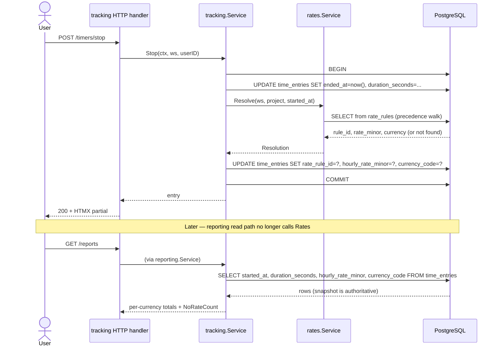
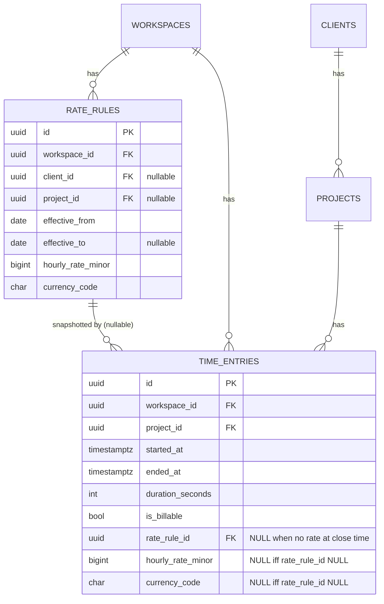

## Context

TimeTrak's `rates.Service.Resolve(ctx, workspaceID, projectID, at)` already accepts a point-in-time `at` argument, and `reporting.Service.estimateBillable` already passes each entry's `started_at`. The resolver compares date-only windows stored on `rate_rules(effective_from, effective_to)` against `at.UTC().Truncate(24h)`.

What is missing for historical correctness:

- **Reports recompute on every read.** Every dashboard refresh, every report render re-runs `Resolve` against whatever is currently in `rate_rules`. If an admin edits an old rule (fix a typo, change the amount, shorten the window), every historical report changes retroactively — silently. For a product whose business output is a billable figure, that is a correctness bug.
- **Rules are freely mutable.** `rates.Service.Update` and `rates.Service.Delete` have no referential protection. Nothing in the schema or the service knows that a rule has already been "committed" to a time entry.
- **Boundary semantics are underspecified.** `effective_to` is inclusive-date, overlap check rejects `from ≤ existing.to`, Resolve treats both endpoints as active, and tie-break at the boundary is implicit in `ORDER BY effective_from DESC`. Same-day handoff ("old rule ends 2026-06-30, new rule starts 2026-07-01") works, but the transition day for a rule edited to end _today_ is ambiguous.
- **No regression test** pins the invariant "a rate change after-the-fact does not change a historical entry's billable amount."

Stakeholders:

- **Freelancer users**: need stable, auditable billable totals that match what they would have invoiced on the day the work was logged.
- **Future invoicing (Stage 3)**: needs a stable source of historical billable amounts to lock onto when an invoice is issued.
- **Developers**: need clear immutability rules so future features (merge, split, archive) have obvious guardrails.

## Goals / Non-Goals

**Goals:**

- Guarantee that the estimated billable amount for a **closed** time entry is a function of data captured at stop/save time, not of the current state of `rate_rules`.
- Preserve `rates.Service.Resolve` as the single source of truth for "what rate applies at time T" — invoked once per entry, at the moment the entry is closed or edited, never in the report read path.
- Make `rate_rules` edits/deletes safe by default: rules referenced by entries are immutable in ways that would alter history, with a typed error and a specific UI message.
- Nail down boundary semantics (`effective_to`, adjacency, tie-break, timezone) in specs so future refactors cannot silently regress.
- Keep the `No rate` user experience intact for entries that genuinely have no applicable rule.

**Non-Goals:**

- Invoicing, invoice line-item locking, or PDF/CSV document generation.
- Multi-currency FX conversion — we continue to emit a per-currency map.
- A supersede/split UX for rate rules (flagged as a follow-up).
- Local-timezone billing boundaries. UTC-date remains the billing boundary for Stage 2.
- Touching `tracking` timer start/integrity rules — a separate Stage 2 change owns that.

## Decisions

### Decision 1: Snapshot the resolved rate on the entry

Persist three new columns on `time_entries`:

- `rate_rule_id uuid NULL REFERENCES rate_rules(id) ON DELETE RESTRICT`
- `hourly_rate_minor bigint NULL CHECK (hourly_rate_minor IS NULL OR hourly_rate_minor >= 0)`
- `currency_code char(3) NULL CHECK (currency_code IS NULL OR currency_code = upper(currency_code))`

All three are NULL iff the resolver returned "no rate" for that entry; otherwise all three are set. A DB-level check constraint enforces `(rate_rule_id IS NULL) = (hourly_rate_minor IS NULL) AND (hourly_rate_minor IS NULL) = (currency_code IS NULL)` — they travel together.

**Why these columns specifically:**

- `rate_rule_id` is an audit breadcrumb — lets us answer "which rule did you apply?" without reverse-engineering it from date and precedence. It is also the hook for the immutability rule in Decision 3.
- `hourly_rate_minor` + `currency_code` are denormalized on purpose so reports are one SQL query, not N+1 resolves. This is the "documented read-model reason" permitted by the 3NF guideline in CLAUDE.md.
- `ON DELETE RESTRICT` prevents accidental history loss; combined with the service-level immutability rule (Decision 3), rules can only be deleted when no entry references them.

**Alternatives considered:**

- _Store only `rate_rule_id` and join at read time._ Rejected: brings N+1-style join behavior back when a rule's row is updated post-hoc, and doesn't solve retroactive amount mutation.
- _Add a separate `time_entry_rate_snapshots` table._ Rejected for MVP-adjacent scale: extra join for every report, no clear upside until we also track per-entry tax, per-entry multiplier, etc. Revisit in Stage 3 if invoicing needs richer per-line data.
- _Compute and cache in application memory._ Rejected: a cache is a correctness surface we don't need; the DB is the system of record.

### Decision 2: Snapshot is written at entry close/edit time, inside the same transaction

When the tracking service stops a timer or saves an edit to an entry's `project_id`, `started_at`, `ended_at`, `duration_seconds`, or `is_billable`, it:

1. Resolves the rate with `rates.Service.Resolve(ctx, workspaceID, projectID, started_at)` inside the same transaction.
2. Writes `rate_rule_id`, `hourly_rate_minor`, `currency_code` on the entry.
3. On "no rate" resolutions, writes all three as NULL.

`is_billable = false` entries still get a snapshot written if a rate resolves (for future use) but reports MUST NOT include them in billable totals (existing behavior). Running timers (`ended_at IS NULL`) do not get a snapshot — there's nothing to report yet.

**Why inside the transaction:** avoids a gap where an entry exists without a snapshot and a concurrent rule edit slips in. The transaction also already exists (we set `ended_at` and `duration_seconds` there), so there is no new transactional cost.

**Alternatives considered:**

- _A background "finalize" job._ Rejected: introduces eventual consistency into a core correctness path and an extra failure mode (job lag).
- _Lazy snapshot on first report read._ Rejected: "first read" becomes a hidden write, and two concurrent report reads race for the write.

### Decision 3: Referenced rate rules are immutable on the historical axis

`rates.Service.Update` and `rates.Service.Delete` must reject changes that would alter the view any existing `time_entries.rate_rule_id = R` got. Specifically, if any entry references rule `R`:

- Delete is rejected with `ErrRuleReferenced`.
- Update is rejected with `ErrRuleReferenced` **except** when the only change is to extend an open-ended `effective_to` (NULL → a future date) or to shorten `effective_to` to a date `>=` the latest referencing entry's `started_at::date`. These are safe: they do not rewrite any entry's history; they only restrict the window _going forward_.
- Everything else (`hourly_rate_minor`, `currency_code`, `client_id`, `project_id`, `effective_from`, or shortening `effective_to` into the past) is rejected.

The check is a single `SELECT EXISTS` against `time_entries.rate_rule_id`, run inside the update/delete transaction. It is cheap because the new column gets an index (see Decision 7).

Because the snapshot already captured the rule's state at entry-close time, the product-level answer to "I fixed a typo in an old rule, will my reports change?" becomes a clear "no — existing entries keep their original figures; new entries from today onward resolve normally." If the operator needs a different figure on historical entries, they must explicitly re-stamp those entries (a separate Stage 3 workflow, out of scope here).

**Alternatives considered:**

- _Soft-delete the old rule and create a new one._ Rejected as the _only_ mechanism: it doesn't stop someone from editing the old rule's amount in place. Soft-delete is a later-stage feature layered on top of this guardrail.
- _Full immutability (any change is rejected if referenced)._ Rejected: an admin legitimately needs to close an open-ended rule on a future date when a rate increase lands. Denying that common case would push people into deleting-and-recreating, which is worse.

### Decision 4: Boundary semantics of `Resolve` are made explicit

- `effective_from` is **inclusive**: the rule is active on and after this UTC date.
- `effective_to` is **inclusive**: the rule is active up to and including this UTC date. NULL means open-ended.
- Two rules at the same precedence level may not have overlapping `[effective_from, effective_to]` ranges. **Adjacency (`A.effective_to + 1 day = B.effective_from`) is the required pattern for a handoff.** `A.effective_to = B.effective_from` is rejected as overlap.
- When `Resolve(ws, project, at)` is called, `at` is converted to a UTC date (`at.UTC()`; the date part). With overlap now strictly disjoint, the matching rule at any given precedence tier is unique; no tie-break is needed at the same tier.
- Precedence across tiers remains unchanged: project > client > workspace-default > no-rate.

This tightens the overlap check in `assertNoOverlap`: the predicate changes from `effective_to >= new.effective_from` to `effective_to > new.effective_from - 1` (or equivalently `effective_to >= new.effective_from` with `effective_to != new.effective_from`), and similarly from `effective_from <= new.effective_to` to `effective_from < new.effective_to + 1`.

**Migration risk:** existing data could contain `A.effective_to = B.effective_from`. The backfill migration scans for such cases and fails loudly if any are found, so we do not silently "fix" historical overlap. Operators fix the data (e.g., set `A.effective_to = B.effective_from - 1 day`) and retry the migration.

### Decision 5: Reports read the snapshot; resolver is not called at report time

`reporting.Service.estimateBillable`, `estimateByClient`, `estimateByProject` change from:

```
for each billable entry in range:
    r = rates.Resolve(ws, project, entry.started_at)
    if r.Found: out[r.CurrencyCode] += DurationBillable(entry.seconds, r.HourlyRateMinor)
```

to:

```
SELECT started_at, duration_seconds, hourly_rate_minor, currency_code
FROM time_entries
WHERE workspace_id = $1 AND user_id = $2 AND is_billable
  AND started_at::date BETWEEN $3 AND $4
-- hourly_rate_minor NULL -> counts toward NoRate count; non-NULL -> accumulate
```

The `rates` service is still injected into `reporting.Service` — we keep it for a UI preview path ("if you tracked this entry today, the rate would be X") that a future change will use. It is no longer called on the hot read path.

### Decision 6: Backfill is a one-shot SQL + Go migration step

The new migration pair:

- `00NN_time_entries_rate_snapshot.up.sql`: add the three columns + index + check constraint, nullable.
- Separately, `go run ./cmd/migrate backfill-rate-snapshots` (new sub-command) iterates every workspace and calls `rates.Service.Resolve` for each closed entry with `rate_rule_id IS NULL`, writing the snapshot. Idempotent: re-running is a no-op because the WHERE clause filters on NULL.

We do **not** perform the backfill inside the `.up.sql` — the resolver lives in Go and needs the service's precedence logic. Keeping it in Go ensures the backfill uses _exactly_ the same code path that `tracking` uses going forward.

The migration runner logs a summary: `backfilled=N workspaces=W no_rate=M`. On `no_rate > 0` the operator is expected to audit.

### Decision 7: Index on `time_entries.rate_rule_id`

Add `CREATE INDEX ix_time_entries_workspace_rate_rule ON time_entries (workspace_id, rate_rule_id) WHERE rate_rule_id IS NOT NULL;`. It supports the immutability check in Decision 3 in O(log n) per rule-edit, and is partial to avoid wasting space on no-rate entries.

### Flow diagram



### Schema diagram



## Risks / Trade-offs

- **Risk: backfill surfaces data anomalies (overlapping windows on `effective_to = effective_from`).** → Mitigation: the backfill command detects these before attempting and aborts with a clear error message and the list of conflicting rule IDs. Operator repairs the data (shift `effective_to` back by a day) and retries. Idempotent rerun is safe.
- **Risk: operators are frustrated that an old rule is now "locked".** → Mitigation: the UI surfaces a clear text-and-icon hint ("Referenced by N entries — create a successor rule instead"), the error message is specific, and a follow-up change introduces a proper supersede flow. This change chooses safety over flexibility by default.
- **Risk: snapshot and resolver drift over time** (e.g., someone adds a new parameter to `Resolve` but forgets to plumb it through to tracking). → Mitigation: the Resolve call at entry close is the _only_ place `Resolve` is called from application code (reports no longer call it). A test asserts `reporting` does not import `rates` on its hot path (the service keeps the field but the `estimate*` helpers stop invoking it).
- **Risk: additional storage per entry.** → Trade-off: ~26 bytes per row (uuid + bigint + char(3)) for billions of entries is still trivial at our scale. Accepted.
- **Risk: developers confuse "current rate preview" (still via `Resolve`) with "historical figure" (via snapshot).** → Mitigation: design doc + spec scenarios explicitly cover this, and the UI labels any live preview as "current rate", never mixed into historical totals.
- **Trade-off: soft-coupling of snapshot to rule via FK.** A `DELETE RESTRICT` means an admin cannot hard-delete a rule without first deleting the referencing entries. This is intentional — the rule _is_ part of audit history once referenced.

## Migration Plan

1. **Deploy migration `00NN_time_entries_rate_snapshot.up.sql`** — adds columns (all nullable), the partial index, and the check constraint. Zero-downtime; no rewrites because all defaults are NULL.
2. **Deploy application code** — `tracking.Service` now writes the snapshot on stop/save; `reporting.Service` reads from the snapshot, with a fallback to resolve-at-read for rows whose `rate_rule_id IS NULL` **only when `ended_at IS NOT NULL` AND the row existed before the migration** (this keeps reports correct during the backfill window).
3. **Run `go run ./cmd/migrate backfill-rate-snapshots`** — single-shot, idempotent, logs counts. May be run multiple times.
4. **Once backfill completes cleanly, remove the transitional resolve-at-read fallback** in a follow-up lightweight change, so reports are snapshot-only and the invariant is tight.
5. **Rollback strategy:** the `.down.sql` drops the three columns and the index. The transitional fallback in step 2 means a rollback during the backfill window does not break reports (they go back to the full resolve path). After step 4, rolling back requires re-introducing resolve-at-read — plan accordingly; this is why step 4 is a separate change.

## Open Questions

- **Non-billable entries: should we snapshot anyway?** Current plan: yes (cheap, future-proof for invoicing that may include them as informational lines). If anyone objects in review, we can defer and only snapshot billable entries.
- **What does `rates.Service.Update` allow when a rule is referenced AND the only change is extending NULL `effective_to` to a future date?** Current plan: allow (Decision 3). Confirm in review that this matches operator expectations.
- **Do we need a `rate_snapshot_applied_at timestamptz` audit column on `time_entries`?** Current plan: no — `updated_at` on the entry captures when the entry (and therefore its snapshot) was last written. Revisit if auditing ever separates entry edits from snapshot re-stamps.
