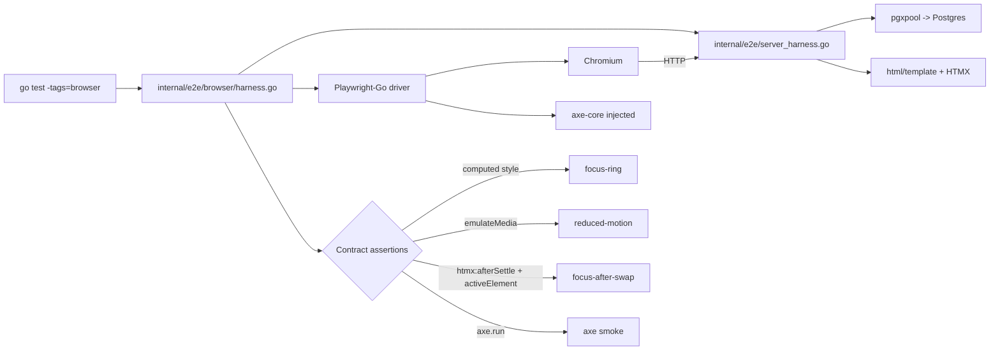

## Context

TimeTrak's UI contracts currently live in three places:

- `web/static/css/tokens.css` + `app.css` — focus-ring rule (`outline: 3px solid var(--color-focus); outline-offset: 2px;`) and `[data-theme="dark"]` overrides.
- `web/static/js/app.js` — the `data-focus-after-swap` handler that restores focus on `htmx:afterSwap`.
- `web/templates/partials/README.md` — the documented target of focus for each HTMX interaction.

These contracts were hardened in the last three archived changes (polish-mvp-ui, create-reusable-ui-partials, establish-custom-component-library-foundation). Each left a handful of manual verification tasks unchecked (§5 a11y walkthrough, §6.3 focus visual, §6.4 reduced motion, §6.6 keyboard walk, §7 visual regression, §7.2 screenshot compare) because they require a real browser and a human. `make test` today runs `go test -p 1 ./...` and exercises HTTP via `net/http/httptest` (see `internal/e2e/happy_path_test.go`) — it cannot detect a broken focus ring, a missing `data-focus-after-swap` target, or a CSS animation that ignores `prefers-reduced-motion`.

The result: a developer who renames `--color-focus` or deletes a `data-focus-after-swap` attribute gets a green build. The regression is only caught by a human keyboard walk or, worse, by a user on assistive tech.

This change introduces an automated browser harness that turns those manual contracts into deterministic test failures.

## Goals / Non-Goals

**Goals:**

- Add a browser-driven test harness that reuses the existing Go test runner and server bootstrap.
- Automate three contract families: focus-ring (per theme), reduced-motion, and `data-focus-after-swap`.
- Run axe-core against every top-level page and fail on `serious`+`critical` violations.
- Gate the harness behind a build tag + opt-in Make target so `make test` stays fast and hermetic.
- Read expected token values from live CSS, not from hardcoded hex strings.

**Non-Goals:**

- Pixel/visual regression or screenshot diffing.
- Cross-browser matrix (Chromium-only).
- Mobile / small-viewport tests.
- Full WCAG 2.2 audit beyond axe's automated checks.
- Lighthouse / performance budgets.
- Storybook or component showcase (that is the next follow-up change).
- Replacing `internal/e2e/happy_path_test.go` or any per-domain `authz_test.go`. The harness is additive.

## Decisions

### Tool: Playwright-Go (pinned)

We pick `github.com/playwright-community/playwright-go` over the alternatives.

Alternatives considered:

- **Playwright + Node test runner.** Best ergonomics and largest ecosystem, but requires a Node toolchain in the repo and CI, introduces a second test runner, and fragments "what does CI run" into Go + Node. Rejected.
- **chromedp.** Pure Go, no external runtime. Solid for scripted flows, but its ergonomics for modern assertions (wait-for-event, emulate-media, `:focus-visible`) are thinner than Playwright's, and axe integration is a manual wire-up. Rejected for first harness.
- **Rod.** Pure Go. Similar tradeoffs to chromedp; smaller community. Rejected.
- **Playwright-Go (chosen).** Wraps Playwright's Node driver behind a Go API. Keeps tests in `go test`, reuses `internal/shared/testdb` fixtures and the existing `httptest.Server` bootstrap, and gives us `EmulateMedia`, `WaitForLoadState`, `Locator.Evaluate`, and axe injection out of the box. Tradeoff: it still downloads Playwright's browser binaries (~200MB) on first install. Mitigated by an opt-in `make browser-install` target and a graceful skip when binaries are missing.

Pin the Playwright-Go version in `go.mod` and document the pin in `internal/e2e/browser/harness.go`. Upgrades go through a normal OpenSpec change.

### Harness layout

```
internal/e2e/
  happy_path_test.go          (unchanged; keeps using the shared server bootstrap)
  server_harness.go           (extracted shared helper: builds *http.Server, applies migrations, seeds)
  browser/
    harness.go                (//go:build browser — launches Chromium, opens workspace, returns Page)
    focus_ring_test.go        (//go:build browser — table-driven primitives x themes)
    reduced_motion_test.go    (//go:build browser — emulateMedia + transition assertion)
    focus_after_swap_test.go  (//go:build browser — one sub-test per documented scenario)
    axe_smoke_test.go         (//go:build browser — per-page axe pass)
```

Every file under `internal/e2e/browser/` carries `//go:build browser` so it is invisible to `go test ./...` and to `make test`. The harness skips gracefully (with a pointer to `make browser-install`) when the Playwright driver/browser binaries are absent, mirroring the `testdb.Open(t)` skip pattern.

### Make targets

```
make browser-install   # one-time: installs Playwright driver + Chromium
make test-browser      # go test -tags=browser ./internal/e2e/browser/...
```

`make test` is unchanged. CI runs `make test-browser` as a separate, opt-in stage.

### Reading expected values from live CSS

The focus-ring contract does not hardcode `#...` values. Each test evaluates:

```js
getComputedStyle(document.documentElement).getPropertyValue('--color-focus').trim()
```

and compares it against the element's resolved `outline-color`. Same pattern for `--outline-offset` if/when that is tokenized. This means a token rename shows up as either a pass (if all three places were updated together) or a targeted failure (if only one was), not as a noisy update across every test row.

### HTMX synchronization

Every interaction that triggers an HTMX swap waits on a deterministic event — `page.WaitForEvent("response")` plus `page.WaitForFunction("htmx.find('body').hasAttribute('data-htmx-settled')")` or the equivalent `htmx:afterSettle` listener — before asserting on DOM state. No raw `time.Sleep`. No `networkidle` as a substitute for the settle event.

### axe-core integration

Inject axe via Playwright's script injection on each page under test, then run `axe.run()` with the rule tags `wcag2a`, `wcag2aa`, `wcag22aa`. Fail the test when any result has `impact` in `{"serious", "critical"}`. `moderate` and `minor` findings are logged as warnings and attached to the trace artifact, not failed — this keeps the gate honest about what the team has committed to and leaves the remaining gap visible.

### Fixtures and auth

The harness reuses the existing signup flow: each test creates a fresh workspace over HTTP, stores the session cookie in the browser context, and drives the UI from there. CSRF works naturally because the browser round-trips the signed double-submit cookie. `internal/shared/testdb` truncates between tests, same pattern as the existing e2e suite.

### Architecture



## Risks / Trade-offs

- **HTMX timing flakiness** → Only wait on deterministic events (`htmx:afterSettle`, completed `response`). No raw sleeps. Any test that needs a sleep is a test bug.
- **Browser binary bloat (~200MB)** → `make browser-install` is opt-in; CI caches the Playwright install directory keyed on the pinned version.
- **Test drift from contracts** → Read `--color-focus` and related token values from live CSS via `getComputedStyle` so a rename fails one focused assertion, not the whole matrix.
- **Float / color-space precision on computed colors** → Compare on normalized RGB strings (Playwright returns `rgb(r, g, b)` consistently). Avoid computing luminance in JS for this change; contrast ratios stay out of scope.
- **Playwright-Go API churn** → Pin the dependency; upgrades are their own OpenSpec change. Document the pin in `harness.go`.
- **Auth + CSRF in a browser** → Reuse the real signup flow so cookies are set by the server. Do not forge session tokens in tests.
- **Scope creep toward visual regression** → Explicitly out of scope in proposal + spec. Reject PRs that add screenshot diffing under this harness; that is a separate change.
- **Skip behavior must stay graceful** → When the Playwright driver is missing, skip with a clear message pointing to `make browser-install`. Do not error. Mirrors `testdb.Open(t)`.

## Migration Plan

This change is purely additive:

1. Add the Playwright-Go dep and pin.
2. Extract the server bootstrap helper from `internal/e2e/happy_path_test.go` into `internal/e2e/server_harness.go` with no behavior change.
3. Land `internal/e2e/browser/harness.go` + the four test files behind `//go:build browser`.
4. Add `make browser-install` and `make test-browser`.
5. Wire a CI stage that runs `make test-browser` on Linux Chromium only, with screenshot + trace artifacts on failure.

Rollback: delete `internal/e2e/browser/` and the two Make targets; the dep can stay or be removed via `go mod tidy`. No production code, no data, no migrations are touched.

## Open Questions

- Is there already a CI config file in the repo that we should extend, or do we land a minimal `.github/workflows/` stub in the tasks change? (Check at task time; if none exists, the stub is an optional follow-up, not a blocker for this change.)
- Which exact Playwright-Go version to pin — resolve at implementation time by taking the latest tagged release compatible with the repo's Go toolchain.
