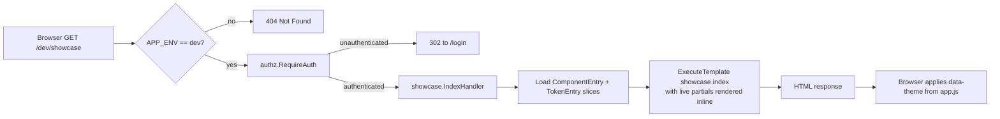

## Context

TimeTrak's Stage 2 UI work has landed two foundational artifacts: a CSS authoring contract (`web/static/css/README.md` + `openspec/specs/ui-foundation/spec.md`) and a reusable partial catalogue (`web/templates/partials/README.md` + `openspec/specs/ui-partials/spec.md`). Both are prose. A contributor extending a page today has to read the README, open the partial source, infer the `dict` contract, and guess at state permutations by grepping handler code. The foundation does not yet have a browser-visible reference surface. This change builds that surface as an internal, dev-only page rendered by the existing Go + `html/template` + HTMX stack — no new runtime dependencies, no build tooling, no authoring environment.

The showcase is the developer-facing complement to the specs. Specs say what MUST exist; READMEs say how to author; the showcase shows what currently exists, rendered live, against the same token stylesheet the rest of the app consumes.

## Goals / Non-Goals

**Goals:**

- A single, dev-only URL (`/dev/showcase`) that catalogues every reusable partial and every design token presently in the repo, rendered against the real stylesheet.
- Every catalogue entry includes: a rendered example, a copy-ready template snippet, the documented `dict` contract (for partials), and a link to the source file plus the relevant spec requirement.
- Zero drift between the showcase and the real components: the showcase renders real partials via the live template loader. It never re-implements them.
- Zero production exposure: the handler is registered in `cmd/web/main.go` only when `APP_ENV=dev`, and also refuses at request time in non-dev environments.
- Coverage enforcement: a unit-level test enumerates partials from `web/templates/partials/` and asserts each non-grandfathered one has a showcase entry; a browser contract test asserts reachability + axe smoke.
- Theme parity: the existing `data-theme` toggle (in `web/static/js/app.js`) works on showcase pages unchanged.

**Non-Goals:**

- Production exposure. Not now, not later.
- Authoring-tool integrations: Storybook, MDX, Figma sync.
- In-page live code editing (CodeMirror, Monaco). Snippets are static `<pre><code>` text.
- Syntax highlighting. A plain monospace `<pre>` is sufficient.
- Introducing new components or new tokens. If cataloguing surfaces a gap, that is a follow-up change.
- Brand refresh. That is the next follow-up (`refine-timetrak-brand-and-product-visual-language`).
- i18n. English only.
- Component versioning / changelog. The OpenSpec archive already serves that purpose.
- Automated screenshot generation per entry.
- Workspace-aware behavior. The showcase lives outside the domain model.

## Decisions

### Route & package placement

- **Decision**: Mount the showcase at `GET /dev/showcase` and a small set of sub-routes (`/dev/showcase/tokens`, `/dev/showcase/components`, `/dev/showcase/components/<partial-name>` for deep links). Owning package is `internal/showcase/`.
- **Why `/dev/` prefix**: unambiguously signals "not product surface" in logs, traces, and browser history. Easy allowlist/denylist target for future reverse-proxy rules.
- **Why a new package**: the showcase is not a domain. It must not live under `internal/clients`, `internal/tracking`, etc. A sibling package keeps it out of the domain graph and out of workspace-scoped handlers.
- **Alternatives considered**: `/static/showcase.html` as a static file (rejected — defeats live-partial rendering); mounting inside an existing domain (rejected — pollutes domain boundaries).

### Dev-only gating

- **Decision**: belt-and-suspenders. Route registration in `cmd/web/main.go` is guarded by `cfg.AppEnv == "dev"` (or equivalent); the handler itself also checks the env at request time and returns 404 (not 403) when non-dev. The 404 path matches how cross-workspace access is denied elsewhere.
- **Why two gates**: if a deploy misconfigures env vars and ships with `APP_ENV=dev` accidentally, the registration gate is the first defense. If a future refactor regresses registration but the handler is still reachable via another path, the runtime gate is the second defense.
- **Alternatives considered**: build tag (`//go:build dev`) — rejected; build tags complicate local dev workflows and hide code from `go vet` / linters. Env var gate is lower friction and equally safe given the double-check.

### Auth posture

- **Decision**: require a session via the existing `authz.RequireAuth` middleware, but do NOT require a workspace. Showcase is reachable to any authenticated user in dev; a freshly signed-up user with no workspace can still view it.
- **Why session-required**: even in dev, unauthenticated traffic to `/dev/*` is noise. `RequireAuth` is the cheapest gate that matches the rest of the app.
- **Why no workspace requirement**: the showcase is domain-agnostic. Forcing workspace setup to view components is friction without benefit.
- **Alternatives considered**: no auth at all — rejected, makes the surface trivially scrapable even accidentally; workspace-required — rejected, adds friction for fresh dev accounts.

### Rendering model: real partials, never re-implementations

- **Decision**: the showcase renders every component example by calling `template.ExecuteTemplate(w, "<partial-name>", <dict>)` through the same loader that domain pages use. There is no parallel template tree for examples.
- **Why**: the whole point is to prevent drift. If a partial's `dict` contract changes and the showcase example still passes the old keys, the showcase breaks at render time in dev — which is exactly when a contributor would catch it.
- **Alternatives considered**: a parallel, simplified markup for examples — rejected; that creates a second surface to maintain and hides the real contract. A "pseudo-render" that statically HTML-escapes source — rejected; that doesn't exercise the real component.

### Snippet fixtures

- **Decision**: every component entry has a colocated fixture (a plain text file under `internal/showcase/snippets/` or `//go:embed` block in the catalogue metadata) containing the copy-ready template call. The same `dict` payload used to render the live example is the one shown in the snippet, keyed by a stable entry id. A contract test asserts that for every `ComponentEntry`, the referenced partial name resolves against the template loader — if a snippet references `{{template "empty_state" ...}}` and that block does not exist, the test fails.
- **Why colocated, not inline HTML-escaped in the template**: keeps the snippet text authoritative, easy to copy, and easy to unit-test against the loader.
- **Why text files (or embed) and not Markdown**: no markdown renderer. We write `<pre><code>` with existing CSS and treat content as opaque text.

### Catalogue metadata shape

- **Decision**: two Go slices declared in the `internal/showcase` package drive the pages:

  ```go
  type ComponentEntry struct {
      ID            string            // url slug + anchor id
      Name          string            // display name (e.g. "flash")
      PartialName   string            // template block name, e.g. "flash"
      SourcePath    string            // web/templates/partials/<name>.html for the source link
      SpecRef       string            // e.g. "openspec/specs/ui-partials/spec.md#..."
      Purpose       string            // one-paragraph prose description
      DictKeys      []DictKeyDoc      // documented keys (name, required, default, note)
      Examples      []ComponentExample // rendered permutations (name, dict, snippet fixture id)
      A11yNotes     []string          // bullet list of ARIA / focus obligations
  }

  type TokenEntry struct {
      ID        string // url slug + anchor id
      Name      string // CSS custom property name, e.g. "--color-accent"
      Family    string // "semantic-color" | "primitive-ramp" | "spacing" | "radius" | ...
      Role      string // documented semantic role
      Preview   string // "swatch" | "sizing-bar" | "sample-text" | "motion-demo" | ...
  }
  ```

- **Why**: single source of truth per catalogue, easy to iterate in a template, easy to enumerate in tests.
- **Alternatives considered**: driving the catalogue from parsed source (inspecting `web/templates/partials/*.html` at startup) — rejected as overengineering for MVP; coverage test is sufficient.

### Theme toggle & computed values

- **Decision**: reuse the existing `data-theme` attribute and the toggle in `web/static/js/app.js`. For each token, the showcase template reads the CSS custom property at the point of render via a small CSS surface (`style="background: var(--color-accent)"` for swatches; `style="padding: var(--space-4)"` for spacing bars; sample text for typography). We do NOT resolve computed values server-side; the browser does that live.
- **Why**: free dark-mode coverage, zero server-side CSS parsing, and the displayed value stays truthful under theme switching.
- **Alternatives considered**: server-rendered computed values (rejected — requires a CSS parser and duplicates `getComputedStyle` semantics).

### Browser contract coverage

- **Decision**: one new file `internal/e2e/browser/showcase_test.go` gated by `//go:build browser`. It asserts:
  - `/dev/showcase` returns 200 in dev-env test run,
  - `/dev/showcase/tokens` and `/dev/showcase/components` return 200,
  - axe-core smoke passes on `wcag2a` + `wcag2aa` + `wcag22aa` with zero `serious` / `critical` on both catalogue pages,
  - every in-page anchor (`#entry-<id>`) scrolls to an element that exists.
- **Why**: the existing browser harness already asserts these patterns for product pages; reusing it keeps the contract cost minimal.

### Partial-coverage enforcement

- **Decision**: a plain `go test` in `internal/showcase/` enumerates files under `web/templates/partials/` (via `os.ReadDir` relative to the repo root, resolved through a helper) and asserts each non-grandfathered `.html` file has exactly one `ComponentEntry` whose `PartialName` matches the file stem. Partials listed in a documented grandfather list (domain composites like `dashboard_summary` that are already documented inline in their section) are allowed to have a single tombstone entry pointing at their source.
- **Why**: if we ship a new partial without updating the showcase, the test fails at `make test`, not at "someone notices later."
- **Alternatives considered**: runtime panic at startup if a partial is missing — rejected; startup crashes in dev are worse UX than a failing test.

### Request-flow diagram



## Risks / Trade-offs

- **Risk**: showcase silently drifts from real partials because someone renders a static HTML blob instead of calling `ExecuteTemplate`. → **Mitigation**: reviewer contract is explicit in `design.md` and specs; the render path in the handler takes a `PartialName` + `dict` and never accepts a raw HTML string.
- **Risk**: `/dev/showcase` leaks into a production build. → **Mitigation**: registration-time gate in `cmd/web/main.go` (change never wires the route unless `cfg.AppEnv == "dev"`), plus runtime gate in the handler, plus a task that adds a small e2e assertion running with `APP_ENV=prod` that the route returns 404.
- **Risk**: partial coverage gap — a new partial ships without a showcase entry. → **Mitigation**: the enumeration test in `internal/showcase/` fails the build.
- **Risk**: snippet fixture falls out of sync with the partial's `dict` contract. → **Mitigation**: fixtures drive both the live example render and the displayed snippet from the same source; a render failure in dev is the feedback loop. A unit test additionally asserts the fixture's `PartialName` resolves against the template loader.
- **Risk**: session-required but workspace-free path becomes a new code path to maintain. → **Mitigation**: reuse `authz.RequireAuth` unchanged. Document the "auth without workspace" requirement in `ui-showcase` so any future refactor of `RequireAuth` knows the showcase relies on this shape.
- **Trade-off**: no automated screenshot diffs — regressions in rendered examples are caught by human review, not by an image-diff pipeline. Accepted as out-of-scope for MVP; the browser contract test catches the worst-case "page broke" regressions.
- **Trade-off**: no authoring-tool parity (Storybook, MDX). Contributors who want a richer component workbench do not get one. Accepted — the stack is Go + HTMX + stdlib templates; introducing Node tooling for a dev-internal surface is not worth the ongoing cost.
- **Open question**: should the contribution guide live as a separate partial or as a prose section on the index? Deferred to implementation — both shapes satisfy the spec; the implementer picks whichever reads better in-page.
