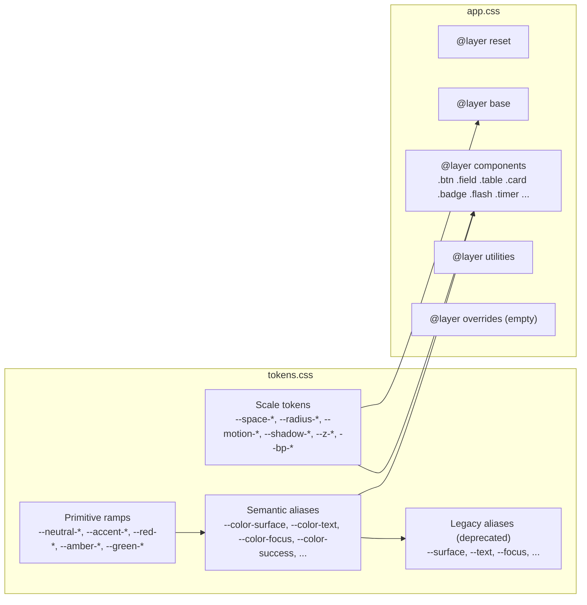

## Context

TimeTrak is a server-rendered Go + `html/template` + HTMX application. The MVP shipped with:

- A flat design-token file at `web/static/css/tokens.css` (colors, spacing, radius, fonts) with a light `:root` set, a `[data-theme="dark"]` override, and a `prefers-color-scheme` branch.
- A single `web/static/css/app.css` that layers base type, app shell, buttons, forms, tables, cards, badges, flash, timer, and empty-state styles directly (no CSS layering, no naming convention beyond legacy BEM-ish shorthands like `.btn-primary`, `.badge-running`).
- A partial system (`web/templates/partials/`) whose conventions were just codified in the prior change `create-reusable-ui-partials-and-patterns` (README lists canonical partials, event contract, focus rule). Component CSS and the partials are in lockstep in naming — e.g. `.timer` matches `timer_widget.html`, `.table` matches row partials.

Three observations drove this change:

1. **Raw tokens are consumed directly by components.** `--accent`, `--surface`, `--border` are both *what the ramp produces* and *what the component uses*. There is no indirection layer, so a brand change (Stage 2 #4) would cascade through every component CSS rule. The style guide quotes the flat token list as if that is the target — it is not.
2. **No documented layer order or authoring contract.** `app.css` mixes reset (`*, *::before, *::after { box-sizing: border-box; }`), base typography, app-shell, and component rules in one cascade. There is no rule preventing a future contributor from redefining a token inside a component, and no stated naming convention for new components.
3. **The next change (`create-component-library-showcase-and-usage-docs`) needs a foundation to showcase.** Without a written contract, the showcase will either codify ad-hoc conventions post-hoc or rediscover them.

Binding constraints carried in:

- Go `html/template` + HTMX + stdlib `net/http`. No SPA framework, no preprocessor, no build step.
- `tokens.css` and `app.css` are the only stylesheet entry points. No file split that requires a bundler.
- WCAG 2.2 AA enforced; focus rings must meet SC 1.4.11 (3:1), target size SC 2.5.8 (24×24), motion respects `prefers-reduced-motion`.
- The existing HTMX event contract and `data-focus-after-swap` helper are out of scope — partial conventions belong to the prior change's `ui-partials` capability.
- Dark mode is already wired via `[data-theme="dark"]` + `prefers-color-scheme`; any token work must keep both branches functioning.

## Goals / Non-Goals

**Goals:**

- Formalize a two-layer token model (primitives → semantic aliases) so components never consume raw ramp values.
- Document the canonical scale tokens (spacing, radius, typography, motion, elevation, z-index, breakpoints).
- Adopt a single CSS layer order so token / base / component / utility / override precedence is deterministic.
- Publish the component authoring contract (naming, state classes, focus ring, target size, variant vocabulary) so future component work has a canonical reference.
- Bake accessibility obligations into the token layer (documented contrast pairs, single focus-ring token, color-never-sole-signal rule, reduced-motion guard).
- Define how the foundation evolves (adding a token, adding a component, deprecating a token) without breaking existing partials.

**Non-Goals:**

- No new components. `btn`, `field`, `table`, `card`, `badge`, `timer`, `flash` continue to exist as they do today — only their CSS is re-pointed at semantic aliases where it currently reaches for raw values.
- No visual redesign. Colors, spacing, and radii keep their current perceived values; only the names and the indirection layer change.
- No brand or accent refresh. That is `refine-timetrak-brand-and-product-visual-language`.
- No showcase page, no Storybook-equivalent, no docs site. That is `create-component-library-showcase-and-usage-docs`.
- No preprocessor, no Tailwind / utility framework, no CSS-in-JS, no JS component library.
- No new dark-mode palette work beyond keeping the existing `[data-theme="dark"]` branch functional through the rename.
- No icon system, no fluid-typography scale, no expanded type scale.
- No edits to `docs/timetrak_ui_style_guide.md`. The spec names the CSS file + `ui-foundation` spec as authoritative in the interim; a follow-up updates the doc.

## Decisions

### 1. Token taxonomy: two layers, not three

Introduce two layers:

- **Primitive ramps** (private-ish): `--neutral-0`, `--neutral-50`…`--neutral-900`, `--accent-50`…`--accent-900`, `--red-500/600`, `--amber-500/600`, `--green-500/600`. These anchor the palette. Components MUST NOT reference ramp tokens directly.
- **Semantic aliases** (public): `--color-bg`, `--color-surface`, `--color-surface-alt`, `--color-text`, `--color-text-muted`, `--color-border`, `--color-border-strong`, `--color-accent`, `--color-accent-hover`, `--color-accent-soft`, `--color-focus`, plus severity pairs `--color-success`, `--color-success-soft`, `--color-warning`, `--color-warning-soft`, `--color-danger`, `--color-danger-soft`, `--color-info`, `--color-info-soft`. Components MUST reference only these.

Rejected: a third "component token" layer (e.g. `--btn-primary-bg`). At TimeTrak's size that tier is speculation and introduces three-hop indirection with no payoff. If a specific component later needs a component-scoped token to escape the global alias, it can introduce one locally; the spec does not forbid it, it just does not require it.

Rejected: keeping a single flat layer. That is the current state, and the whole point of this change is to remove the direct ramp → component coupling.

### 2. Keep old token names as deprecation aliases for one change cycle

The current components consume `--accent`, `--surface`, `--text`, `--border`, etc. Renaming to `--color-accent`, `--color-surface`, `--color-text`, `--color-border` without an alias would thrash the partials catalogue that just stabilized.

Decision: define the new semantic aliases as the source of truth; keep the old names as aliases that resolve to the new ones, with a `/* deprecated: remove in next foundation change */` comment. Component CSS re-points to the new names in this change. Next foundation change removes the old aliases.

Example:

```css
:root {
  /* new */
  --color-surface: var(--neutral-0);
  /* deprecated alias, remove next cycle */
  --surface: var(--color-surface);
}
```

### 3. CSS layer order (one declared order, enforced by convention)

Adopt:

```css
@layer reset, tokens, base, components, utilities, overrides;
```

- `reset` — box-sizing, margin resets.
- `tokens` — the entire contents of `tokens.css` belong here.
- `base` — element styles (`body`, `h1-h4`, `a`, `:focus-visible`, `.sr-only`).
- `components` — `.btn`, `.field`, `.table`, `.card`, `.badge`, `.flash`, `.timer`, `.app-shell`, `.nav`, `.empty`.
- `utilities` — `.muted`, `.tabular`, `.num`, `.stack`, `.row`, `.row-between`, `.mt-0`, `.mb-0`.
- `overrides` — intentionally present for future hot-fixes; empty at landing.

Rationale: `@layer` is native CSS, works in every TimeTrak-supported browser, requires no tooling, and makes precedence deterministic without relying on source order. Rejected: BEM-only discipline (already partially followed but cascade still fights you on specificity); `!important` convention (unreadable); separate `.css` files per layer (multiplies HTTP requests under the current "no build step" rule, adds entries to the HTML template).

The `reduced-motion` block stays at the bottom of `app.css` as a cross-cutting media query, outside the layered cascade — its `!important` on transition/animation is the one approved use.

### 4. Component authoring contract

Single naming convention: `tt-<component>` for new components (e.g. `tt-button`, `tt-field`). Legacy selectors (`.btn`, `.field`, `.table`, `.card`, `.badge`, `.timer`, `.flash`, `.empty`, `.nav`, `.app-shell`, `.app-header`, `.app-sidebar`, `.app-main`) are grandfathered and MUST NOT be renamed in this change. New components introduced in the showcase change SHALL use the `tt-` prefix.

State classes: `is-<state>` for JS-toggled / server-rendered state (`is-disabled`, `is-loading`, `is-active`); ARIA-driven state (`[aria-current]`, `[aria-invalid]`, `[aria-expanded]`, `[data-theme]`) preferred where a native attribute exists. Components MUST NOT use ad-hoc class names like `.disabled` or `.active`.

Variant vocabulary: `primary`, `secondary` (default / ghost baseline), `ghost`, `danger`. Semantic meaning:

- `primary` — one per page region (per style guide); the main action.
- `secondary` — the default when emphasis is not needed. Bordered, non-accent fill.
- `ghost` — lowest-emphasis interactive element. No border, no fill at rest.
- `danger` — destructive. Paired with destructive copy; never the only non-text signal.

Other variants (e.g. `success`, `warning`) MUST NOT be introduced without a change proposal updating this spec. Severity *status* belongs on badges / flash, not buttons.

Size scale: `sm` / `md` / `lg` permitted **only when real usage justifies**. MVP components ship `md` only; the showcase change may add sizes when it documents them.

### 5. Focus ring: one token, measured contrast

Single token `--color-focus`, resolved to a color that achieves ≥3:1 against every surface it can appear on (`--color-surface`, `--color-surface-alt`, `--color-bg`, `--color-accent`) in both light and dark themes. Focus ring rule stays in `base`:

```css
:focus-visible {
  outline: 3px solid var(--color-focus);
  outline-offset: 2px;
  border-radius: 2px;
}
```

Rejected: per-variant focus tokens (`--focus-on-primary`, `--focus-on-danger`). Adds permutation pressure with no visible win. If a specific variant needs a different ring, the component SHALL override `outline-color` with a documented token, not introduce a new focus primitive.

Windows high-contrast mode: the outline uses `CanvasText` fallback in a separate block under `forced-colors` is deferred to the showcase change (documented as a known follow-up), because current legacy selectors already pass visual focus and the token rename is the priority here.

### 6. Minimum target size

All interactive elements MUST render with at least 24×24 CSS pixels of hit area (WCAG 2.2 SC 2.5.8 / "Target Size (Minimum)"). Existing `.btn` is 36px tall and ≥44px wide — passes. Icon-only controls added in future changes MUST meet this bar.

### 7. Motion tokens + reduced-motion

Add motion tokens:

```css
--motion-duration-fast: 120ms;
--motion-duration-normal: 200ms;
--motion-easing-standard: cubic-bezier(0.2, 0, 0, 1);
```

Components use these, not raw durations. The existing reduced-motion block at the bottom of `app.css` continues to collapse all transitions/animations to instant and is retained.

Rejected: per-component motion tokens. Overkill for MVP scope.

### 8. Elevation policy

Per CLAUDE.md and the style guide: borders are the primary separation tool. Shadow tokens are named but used sparingly. Introduce:

```css
--shadow-none: none;
--shadow-sm: 0 1px 2px rgb(0 0 0 / 0.06);
--shadow-md: 0 4px 8px rgb(0 0 0 / 0.08);
```

Cards default to `--shadow-none` + `1px solid var(--color-border)`. Modals / dropdowns (future) use `--shadow-md`. No shadow on dark-mode surfaces unless a later change demonstrates the need.

### 9. Z-index layers

Small, enumerated stack:

```css
--z-base: 0;
--z-sticky: 10;
--z-dropdown: 100;
--z-modal: 1000;
--z-toast: 1100;
```

Raw z-index integers in component CSS are prohibited.

### 10. Breakpoints

MVP is largely desktop-first with responsive tables. Declare, but do not act on, three breakpoints:

```css
--bp-sm: 640px;
--bp-md: 960px;
--bp-lg: 1280px;
```

Used only in media queries; not consumed at runtime via JS.

### 11. Authoring-contract documentation location

Decision: the contract lives in a new `web/static/css/README.md`. Rationale: it sits next to the CSS it governs; `web/templates/partials/README.md` already covers template-side conventions from the prior change, and stuffing CSS conventions there blurs scope. The two READMEs cross-link.

Rejected: appending to the partials README. Rejected: a top-level `docs/` file. The doc is developer-facing reference, not product docs.

### 12. Authoritative-source rule during transition

Until `docs/timetrak_ui_style_guide.md` is updated in a follow-up:

- `web/static/css/tokens.css` + `web/static/css/README.md` + `openspec/specs/ui-foundation/spec.md` are authoritative for tokens and authoring rules.
- The style guide is advisory; where it disagrees with the codified tokens, the codified tokens win.
- The spec records this explicitly so reviewers know which source to trust.

### 13. Migration mechanics

Order within this change:

1. Audit `tokens.css` + `app.css` for ad-hoc values, duplications, and gaps.
2. Introduce primitive ramps at the top of `tokens.css`.
3. Introduce semantic aliases resolving to ramps.
4. Keep legacy token names as deprecation aliases that resolve to the semantic layer.
5. Add scale tokens (motion, shadow, z, breakpoint) where missing.
6. Add `@layer` declaration at the top of `app.css`; wrap existing rule groups in the appropriate layer.
7. Re-point component selectors to the semantic aliases (mechanical rename).
8. Write `web/static/css/README.md` documenting the contract.
9. Run accessibility validation: contrast pairs (4.5:1 text, 3:1 non-text), focus-ring visibility on every surface, reduced-motion verification, manual keyboard walk.

Rollback: every step is a CSS edit. Reverting the change restores the flat token layer; no data or handler impact.

## Architecture diagram



## Risks / Trade-offs

- **Token rename thrashes existing component CSS** → Mitigation: decision 2 (keep legacy names as deprecation aliases); component CSS updates are mechanical and reviewed in the same change that lands the new layer so any regression is caught in-context.
- **Over-abstraction (too many semantic aliases)** → Mitigation: the spec enumerates the exact set of semantic aliases; new aliases require a change proposal that extends the spec.
- **Focus-ring contrast regression** → Mitigation: explicit validation task checks the focus token against every surface it can appear on in both themes.
- **Authoring convention ignored by future contributors** → Mitigation: the spec encodes the rules as MUSTs; the `web/static/css/README.md` is linked from CLAUDE.md so new contributors see it.
- **Divergence from `docs/timetrak_ui_style_guide.md`** → Mitigation: the spec names the CSS + `ui-foundation` spec as authoritative during the transition; a follow-up updates the style guide.
- **Primitive ramps consumed anyway** → Mitigation: the README explicitly forbids it; the showcase change (next) will act as the first compliance check.
- **`@layer` adoption risk** → None meaningful. Supported in every evergreen browser since 2022; if a hypothetical user loaded TimeTrak in an ancient browser without layer support, the rules would still apply in source order (which matches layered precedence for this file). No polyfill needed.

## Migration Plan

1. Land this change as a single PR: token taxonomy + `@layer` adoption + component re-point + README. The change is small enough (one CSS file expanded, one re-pointed, one README added) to review holistically.
2. After landing, open a follow-up to update `docs/timetrak_ui_style_guide.md` to cite the codified tokens. That follow-up is out of scope here.
3. After the showcase change (`create-component-library-showcase-and-usage-docs`) lands, open a later foundation change to remove the deprecation aliases.

Rollback: revert the PR. No schema, handler, or partial markup changes means rollback is a single git revert with no residual state.

## Open Questions

- Should the `forced-colors` (Windows high-contrast) override ship in this change or wait for the showcase? **Current lean:** wait. The legacy selectors already render visible focus; chasing high-contrast coverage here risks expanding scope into per-component work that the showcase change is better positioned to address.
- Should the scale token names follow T-shirt sizing (`--space-sm`, `--space-md`) or the numeric scheme currently in `tokens.css` (`--space-1` … `--space-8`)? **Current lean:** keep the numeric scheme. Renaming every spacing consumer is out of proportion to the benefit; the numeric scale matches the style guide's documented scale. Add semantic aliases (e.g. `--space-gutter`) only if a specific component needs one.
- Should we introduce a `--color-on-accent` token for text that sits on the accent surface? **Current lean:** not yet. The current `#fff` hardcode on `.btn-primary` is the only consumer; add the alias in the showcase change when a second consumer appears.
