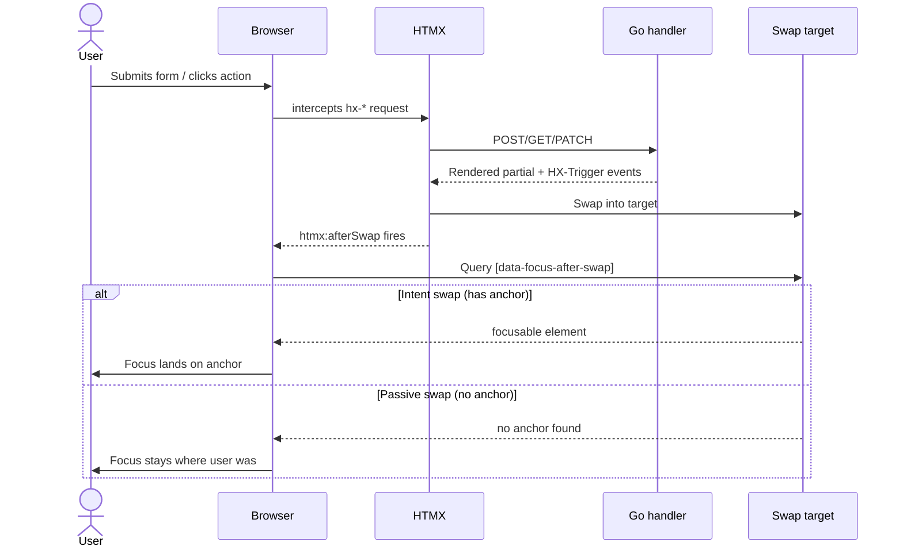

## Context

The MVP shipped with a usable server-rendered + HTMX surface, a theme toggle, and a `data-focus-after-swap` convention, but polish is uneven across domains. The bootstrap change and subsequent Stage 2 changes (`harden-workspace-authorization-boundaries`, `improve-timer-concurrency-and-entry-integrity`, `stabilize-rate-resolution-history`, `tighten-reporting-snapshot-only`) focused on correctness; UI pattern drift was intentionally deferred.

Current state audit (as of 2026-04-21):

- `web/templates/layouts/base.html` provides a skip link and `<main id="main">` landmark; page `<title>` is set at the layout level as the literal `TimeTrak` and overridden inconsistently per page.
- `web/templates/layouts/app.html` provides header (`role="banner"`), sidebar (`aria-label="Primary"`), and main landmarks, plus a live region `#global-status` and `aria-current="page"` on nav links. The theme switcher exposes three buttons but does not expose current state as `aria-pressed`.
- `web/static/js/app.js` applies focus to `[data-focus-after-swap]` inside the swap target on `htmx:afterSwap`. No focus trap helper exists for `<dialog>` flows.
- Partials: `confirm_dialog.html` exists but is unused; every destructive delete today goes through `hx-confirm` (native `confirm()`). `flash.html`, `pagination.html`, `spinner.html`, row partials, and a `rate_form.html` exist.
- Per-domain pages (`auth/*`, `clients/index.html`, `projects/index.html`, `rates/index.html`, `reports/index.html`, `time/index.html`, `workspace/settings.html`, `dashboard.html`) were authored independently and drift on form-error markup, table semantics, and status-pill construction.

This design picks one pattern per concern, explains the tradeoff, and defines acceptance criteria that the tasks and spec deltas can check against. It is deliberately markup-and-convention-level; it does not introduce new primitives beyond what exists.

## Goals / Non-Goals

**Goals:**

- Establish one canonical pattern per accessibility concern: focus-after-swap anchors, destructive confirmation, form error wiring, table semantics, status-pill construction, and live-region announcements.
- Define explicit WCAG 2.2 AA acceptance criteria that can be checked per-surface (keyboard walkthrough, screen-reader spot check, axe/Lighthouse, contrast verification).
- Spread existing primitives (`data-focus-after-swap`, `partials/confirm_dialog.html`, `#global-status` live region) to surfaces that lack them.
- Leave the markup in a shape that the next Stage 2 change — `create-reusable-ui-partials-and-patterns` — can extract into shared partials without rewriting.

**Non-Goals:**

- No new capabilities, pages, or routes.
- No token overhaul, no new components, no design-system primitives. Token changes are allowed only for specific contrast failures surfaced by the audit.
- No client-side state library, no SPA router, no new JS dependency. A tiny focus-trap helper for `<dialog>` is allowed only if the audit surfaces a flow that justifies the existing `confirm_dialog.html` partial being put into use.
- No backend schema change. Handler changes are limited to passing field-level error keys into templates and setting explicit per-route `<title>`.
- No redesign of the dashboard, timer widget, or reports UI beyond the accessibility fixes enumerated in the specs.

## Decisions

### D1. Destructive confirmation: two patterns, one decision rule

**Decision.** Use native `hx-confirm` for destructive list-row actions with no additional context (delete a rate rule, delete a time entry, delete a client with no projects). Use `partials/confirm_dialog.html` (a `<dialog>`-based modal) for destructive actions that need to surface side effects (archive a client that has active projects, stop a running timer that would discard an unsaved description, delete a project that has historical time entries).

**Rationale.** Native `confirm()` is zero-cost, keyboard-accessible by default, and sufficient for "are you sure?" prompts. `<dialog>` lets us render structured warning copy, enumerate side effects, and preserve a focus trap. Picking one or the other per flow — instead of mixing — keeps the user's mental model stable.

**Alternatives considered.**

- _All native `confirm()`._ Rejected: cannot render side-effect warnings legibly.
- _All `<dialog>`._ Rejected: adds markup cost and a focus-trap helper to flows where a single-line confirmation is sufficient.
- _Third-party modal library._ Rejected: violates the "no SPA framework / client state library" constraint.

**Consequence.** The spec deltas for `clients`, `projects`, `tracking`, and `rates` call out which pattern each destructive action uses. A tiny focus-trap helper (trap `Tab` inside the open `<dialog>`, restore focus on close) lands in `web/static/js/app.js` only if at least one flow adopts the `<dialog>` pattern; otherwise `confirm_dialog.html` stays as a documented partial for the follow-up change to use.

### D2. Focus anchor policy after HTMX swaps: user-intent swaps only

**Decision.** `data-focus-after-swap` is applied to swap targets that land where the user's intent went (the rate form after save/validation-error, the entry inline editor after open, the timer widget after start/stop, the filter results table after submitting filters). It is **not** applied to passive peer-refresh swaps (dashboard summary refreshing on `entries-changed`, rate list refreshing on `rates-changed` when the user is elsewhere on the page).

**Rationale.** The existing `app.js` helper focuses the first `[data-focus-after-swap]` inside the swap target on every `htmx:afterSwap`. Applying it to passive refreshes would yank focus away from the user's current field. Applying it only to intent swaps preserves the property "focus lands where I was looking."

**Alternatives considered.**

- _Focus every swap._ Rejected: causes focus theft.
- _Focus nothing._ Rejected: leaves keyboard users stranded after form submits.
- _Check `document.activeElement` before focusing._ Rejected as a general rule — it hides bugs where a passive refresh happens to match the active element. The explicit intent/passive split is clearer.

**Consequence.** The design catalogues each swap target below under "Focus-flow catalogue" and flags whether it receives a focus anchor.

### D3. Form error wiring: inline + summary, both required

**Decision.** On server-side validation failure, every form re-renders with (1) a top-of-form summary containing a list of field-error links, wrapped in `role="alert"` with `tabindex="-1"` and `data-focus-after-swap`; and (2) per-field error text in an element with id `#<form-id>-<field>-error`, referenced via `aria-describedby` on the input, plus `aria-invalid="true"` on the input.

**Rationale.** The summary handles screen-reader announcement and gives sighted keyboard users a fast path to the first invalid field. Inline text handles users who are already at the field. Both are the WAI-ARIA Authoring Practices recommendation; one without the other leaves a class of users worse off.

**Alternatives considered.**

- _Summary only._ Rejected: leaves the user guessing which field the error applies to after tabbing away.
- _Inline only._ Rejected: screen-reader users miss the aggregate signal.
- _Toast notifications._ Rejected: ephemeral, color-reliant, not accessible by default.

**Consequence.** Auth, Clients, Projects, Rates, Workspace Settings, and Tracking inline-edit forms all adopt this shape. Handlers pass field-level error keys as `map[string]string` into the template; templates render them via a shared convention (possibly a template function in the follow-up partials change — for this change, inline helpers are acceptable).

### D4. Status pills: text + icon + color, never color alone

**Decision.** Every status pill (`Archived`, `Running`, `No rate`, `Billable`, `Non-billable`, rate-scope labels like `project` / `client` / `workspace default`) renders a visible text label. Where the pill is visually compact, a leading icon or glyph reinforces the label. Color is purely decorative reinforcement. All pill variants pass 4.5:1 contrast against their background token.

**Rationale.** WCAG 2.2 SC 1.4.1 (Use of Color) forbids color as the sole conveyor of meaning. Existing pills already have text; the audit is to close the cases where the text was removed for compactness.

**Consequence.** If a pill variant cannot meet 4.5:1 against its current background token, the fix is scoped to that variant's color only — it does not open token overhaul.

### D5. Table semantics: caption, scope, numeric alignment, sort state

**Decision.** Each primary data table (Clients, Projects, Rates, Reports results, Time entries) has:

- A `<caption>` element. Visually hidden with the `sr-only` utility if the surrounding page header already conveys the same information.
- `<th scope="col">` on every header cell, and `<th scope="row">` on the first cell of each row when that cell identifies the row (e.g. client name).
- Numeric columns (hours, money) aligned via a CSS utility class (`.num` or similar) that applies `text-align: right; font-variant-numeric: tabular-nums;` — never inline `style=`.
- If sortable (reports results), the current sort column exposes `aria-sort="ascending" | "descending"` and every sortable header is a button inside the `<th>`.

**Rationale.** Tables are first-class in TimeTrak; these are the minimum semantics for assistive tech to navigate them row-by-row and column-by-column.

**Consequence.** Row partials (`client_row.html`, `project_row.html`, `entry_row.html`, `rate_row.html`) are adjusted once; the table wrapper pages adjust their `<thead>`.

### D6. Live regions: one per page, polite, reused

**Decision.** The existing `#global-status` live region in `layouts/app.html` (polite) is the single page-level announcement target. HTMX responses that carry a status string use `hx-swap-oob` to replace its text. Empty-state partials embed their own `aria-live="polite"` region when the empty state is the result of an async filter change (reports), so the transition from "loading" to "no results" is announced without requiring the global region.

**Rationale.** Multiple live regions on a page race and confuse screen readers. One global region for cross-cutting status and one local region per filterable results area is the cleanest split.

**Consequence.** `report_empty.html`, `rates_table.html` empty state, and the time entries list empty state each include `aria-live="polite"` on the empty-state container.

### D7. Reduced motion: opt-in to motion, not opt-out

**Decision.** Any CSS transition added by this polish pass is wrapped such that `@media (prefers-reduced-motion: reduce)` collapses it to instant. Existing transitions are audited once; anything not already wrapped is wrapped.

**Rationale.** WCAG 2.3.3 (Animation from Interactions) plus general tool-like feel. The scope is narrow because this change does not introduce substantial new motion.

### D8. Theme toggle state: `aria-pressed` on the three buttons

**Decision.** The three theme buttons in `app.html` gain `aria-pressed="true|false"` reflecting the stored theme, updated by `app.js` when the theme changes. The visible label stays `Light` / `Dark` / `System`.

**Rationale.** The current implementation communicates state only through visual styling; screen-reader users cannot tell which theme is active.

## Focus-flow catalogue

This catalogue fixes D2 per surface. `intent` swaps receive `data-focus-after-swap`; `passive` swaps do not.

| Surface | HTMX target | Trigger | Kind | Focus anchor |
|---|---|---|---|---|
| Timer widget start | `#timer-widget` | `POST /timer/start` | intent | `Stop` button |
| Timer widget stop | `#timer-widget` | `POST /timer/stop` | intent | `Start` button (or description field on new entry if that is the landing) |
| Dashboard summary | `#dashboard-summary` | `timer-changed`, `entries-changed` from body | passive | none |
| Clients list row add | `#clients-table tbody` | `POST /clients` | intent | first cell of the new row |
| Clients list row edit | `#client-row-<id>` | `PATCH /clients/<id>` | intent | `Edit` button of the saved row |
| Clients list row delete | `#client-row-<id>` (remove) | `DELETE /clients/<id>` | intent | `New client` button (as a stable anchor) |
| Projects list | (same shape as clients) | — | — | (same shape as clients) |
| Rates form | `#rate-form` | `POST/PATCH /rates` | intent | first invalid input on error, else `Add rule` button after save |
| Rates table | `#rates-table` | `rates-changed` from body | passive | none |
| Entry inline editor open | `#entry-row-<id>` | `GET /entries/<id>/edit` | intent | description field |
| Entry inline editor save | `#entry-row-<id>` | `PATCH /entries/<id>` | intent | `Edit` button of the saved row |
| Entry inline editor cancel | `#entry-row-<id>` | `GET /entries/<id>` | intent | `Edit` button of the row |
| Time entries pagination | `#entries-table` | `GET /time?page=` | intent | first row cell |
| Reports filter submit | `#report-results` | `GET /reports?...` | intent | results `<table>` element (focusable via `tabindex="-1"`) |
| Flash message | `#flash` | any form submit | passive | none (the flash partial uses `role="status"`) |
| Error partial | `#timer-widget` or inline | error on any action | intent | error container (has `role="alert"`, `tabindex="-1"`) |

## Focus-flow diagram

## Accessibility acceptance criteria

Tasks are checked against these. Each UI-affecting task group ends with a validation task that runs all four checks against its surface.

1. **Keyboard-only walkthrough.** With a physical Tab/Shift+Tab/Enter/Escape walkthrough (no mouse), every interactive element can be reached, operated, and left. Focus is always visible (the token focus ring is present). After every HTMX swap documented as `intent` in the focus-flow catalogue, focus lands on the documented anchor.
2. **Screen-reader spot check.** Using VoiceOver (macOS) or NVDA (Windows), every form field reads its label, required state, and — when invalid — its error text. Every table reads its caption and column headers. Every status pill reads its text label. Every async status change announces once via the page's live region.
3. **Automated axe / Lighthouse.** Running axe-core or Lighthouse accessibility audit on each page surfaces zero critical or serious violations. Warnings are triaged; any that cannot be addressed in this change are logged as follow-ups.
4. **Contrast verification.** Every text-on-background combination used for body text, muted text, and pill variants passes 4.5:1 when measured with a contrast checker. Focus rings pass 3:1 against both the focused element and its adjacent background per SC 1.4.11.

## Risks / Trade-offs

- **[Risk] Audit surfaces a token-level contrast failure** (e.g. `--color-muted` against `--color-surface` falls below 4.5:1). → Mitigation: narrow the fix to the offending token variant only. If the fix would cascade into a token-system rework, log the cascading work as a follow-up and leave the variant with a scoped override in `app.css` for this change.
- **[Risk] Spreading `data-focus-after-swap` regresses peer-refresh flows** (dashboard summary pulling focus away from an active field when the timer ticks). → Mitigation: the focus-flow catalogue above is the allowlist. Any swap not listed as `intent` must not carry the attribute.
- **[Risk] Two confirmation patterns confuse users.** → Mitigation: the decision rule in D1 is codified in the tracking/clients/projects/rates spec deltas. Reviewers check the rule during PR review; tasks.md includes an explicit check.
- **[Risk] Form summary + inline wiring creates template drift across six domains.** → Mitigation: the handlers pass error maps in a uniform shape; templates render them inline for this change. The follow-up change (`create-reusable-ui-partials-and-patterns`) extracts the render into a shared partial. This change does not attempt the extraction to keep scope tight.
- **[Trade-off] We do not add automated accessibility tests** (e.g. axe running in CI). Acceptance is manual per-task. → Rationale: adding a CI-level a11y harness is its own change. This one is a polish pass; adding tooling is a tooling change.
- **[Trade-off] `<dialog>` focus trap may never land.** If the audit finds no flow that truly needs `confirm_dialog.html`, the partial stays unused and the focus-trap helper is deferred. That is acceptable — we do not ship dead code.

## Migration Plan

No runtime migration. The change is markup, a handful of template-rendered attributes, minor CSS utilities, and possibly a small JS helper. Rollback is `git revert`; there is no data shape change, no session shape change, and no route change.

Rollout order (matches tasks.md grouping):

1. Shared layout + token fixes (skip link verification, per-page `<title>`, theme toggle `aria-pressed`, numeric-alignment utility, reduced-motion wrapper).
2. Per-domain forms (auth, workspace settings, rates form, clients, projects inline-edit): error-summary + `aria-describedby` wiring.
3. Per-domain tables (clients, projects, rates, time entries, reports results): caption, scope, numeric alignment, sort state.
4. Destructive confirmation rationalization per D1.
5. Focus-after-swap anchor audit against the focus-flow catalogue.
6. Status-pill audit (text + contrast).
7. Per-surface accessibility validation sweep (keyboard, screen reader, axe/Lighthouse, contrast).

## Open Questions

- Should the flash region (`#flash`) use `role="status"` (polite) or `role="alert"` (assertive)? Proposed: `role="status"` for success flashes, `role="alert"` only for error flashes. Confirm during implementation by checking which variants the handlers emit.
- Does the reports table warrant `aria-sort` in this change, or is sorting a deferred capability? Proposed: only if sortable columns already exist; otherwise skip and let the sorting-capability change handle it.
- Does `workspace/settings.html` need a spec delta? Proposed no (proposal rationale), but if the audit surfaces a MUST-level failure, add a minimal `workspace` delta before this change is applied.

## Implementation notes

Appended during implementation of `polish-mvp-ui-for-accessibility-and-consistency`.

### §4.6 Token-level contrast changes

None. The audit in §4.1–§4.5 confirmed every pill variant (`badge-running`, `badge-billable`, `badge-archived`, `badge-warning`, rate-scope labels) has visible text and meets 4.5:1 against its background in both light and dark themes at the current token values. No token override was needed; the follow-up token work inherits a clean baseline.

### §5.1 Destructive-action classification

| Action | Surface | Pattern | Rationale |
|---|---|---|---|
| Archive client | `clients/index.html` row | native `hx-confirm` | reversible (unarchive), no cascading data loss; single-line prompt is sufficient |
| Unarchive client | `clients/index.html` row | no confirm | non-destructive restoration |
| Archive project | `projects/index.html` row | native `hx-confirm` | reversible; same rationale as clients |
| Unarchive project | `projects/index.html` row | no confirm | non-destructive |
| Delete rate rule | `partials/rate_row.html` | native `hx-confirm` | destructive + cannot be undone, but unreferenced-only (gated by service); single-line prompt is sufficient |
| Delete time entry | `partials/entry_row.html` | native `hx-confirm` | destructive; copy explains reports will recompute; single-line prompt is sufficient |
| Stop timer | `partials/timer_widget.html` | no confirm | stop is a save, not a destructive action — it persists the running entry |

No action was classified as `<dialog>`-based. `partials/confirm_dialog.html` remains unused (kept as documented primitive for a future flow that warrants side-effect copy, e.g. archive-with-active-projects cascade). The `<dialog>` focus-trap helper in `web/static/js/app.js` was intentionally not added, per §5.3's explicit exit condition.

### §7.7 Flash partial variants emitted by handlers

Audit of `internal/*/handler.go` (2026-04-20):

- Only `layout.FlashMessage{Kind: "error", Message: ...}` is emitted today (one site: `internal/projects/handler.go` on failed archive cascade). No `Kind: "success"` flashes exist yet — success paths use `http.Redirect` instead.
- `partials/flash.html` was updated to branch on `Kind`: `error` → `role="alert"` (immediate announcement); anything else → `role="status"` with `aria-live="polite"`. This is ready for future `success` flashes without further changes.

### §6 Focus-flow catalogue deviations

One deviation from the catalogue was taken deliberately:

- **Reports filter submit (`#report-results`)**: the catalogue says focus should land on the results `<table>` via `tabindex="-1"` after each submit. In practice the filter form's `hx-trigger` includes `change from:find select, change from:find input[type=date]`, so every filter-control change swaps the results. Applying `data-focus-after-swap` inside `#report-results` would yank focus away from the filter control the user is actively operating, which fails the "don't steal focus" invariant in D2. The anchor was therefore omitted; focus stays on the active filter control. If sorting or an explicit "Apply" submit is later split from the change-triggered refresh, the anchor can be added to that explicit path only.

