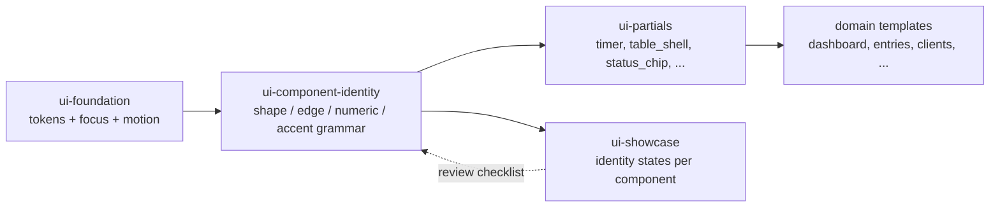

## Context

TimeTrak's `ui-foundation`, `ui-partials`, and `ui-showcase` capabilities already deliver a disciplined token taxonomy, partials contract, focus indicator, reduced-motion handling, and severity system. What they deliberately do *not* constrain is the **visual grammar** of individual components — the shape language, edge treatment, numeric rendering, and accent usage patterns that separate "a table" from "*TimeTrak's* table." The result, observed by the user: screens are correct and accessible, but undifferentiated. The running timer — the product's signature action — has no more visual weight than a filter dropdown.

This change introduces a new capability, `ui-component-identity`, that sits on top of `ui-foundation` (which it consumes) and cross-cuts `ui-partials` (which it refines). It does not replace tokens, partials, or the focus contract. It adds a layer of *authoring rules* and applies them first to the highest-leverage components: timer, data table, status chip, and the cross-cutting focus/border/numeric contracts.

Stakeholders: primary user (hazel@), any future contributor authoring UI. No backend, domain, or data model owners impacted.

## Goals / Non-Goals

**Goals:**

- Give TimeTrak components recognizable, consistent identity *within* the calm/tool-like brand.
- Codify shape language (pill/rectangle/circle), edge language (1px structure / 2px state), numeric rendering (tabular-nums), and accent rationing as reviewable contracts — not vibes.
- Make the timer the app's signature object, visually distinct from any other button on any screen.
- Make data tables read as crafted: hairline dividers, tabular numerics, uppercase letterspaced headers, accent-edge selected row — every list screen in the app benefits.
- Make component identity enforceable via the existing `/dev/showcase` surface and browser contract tests, not via taste.

**Non-Goals:**

- New color tokens, accent palettes, gradients, illustrations, or shadow system. `ui-foundation`'s semantic aliases remain the sole public color/scale contract.
- Dark/light theme **toggle UX** (its own proposal). Dark-theme correctness for sharpened components *is* in scope — they must meet AA in both themes — but the toggle control itself is separate work.
- Datetime input UX (separate proposal).
- Summary cards, empty states, form groups, toasts, filter bar, and dashboard refresh — ranked as second-wave in the UI Designer brief and deferred to `sharpen-dashboard-and-empty-states`.
- Any SPA, client-state, or JS-heavy interaction. The timer pulse is the only new animation, and it collapses under `prefers-reduced-motion`.
- Performance work, backend changes, migrations.

## Decisions

### D1. Introduce a new capability `ui-component-identity` rather than extending `ui-foundation`

**Decision:** Create `openspec/specs/ui-component-identity/spec.md` as a peer to `ui-foundation`, `ui-partials`, and `ui-showcase`.

**Why not extend `ui-foundation`:** `ui-foundation` owns *what tokens exist and how they're layered*. The new contracts — shape language, accent rationing, numeric rendering, component-state edges — are about *how components compose tokens*, not about the tokens themselves. Folding them into `ui-foundation` would blur the capability's purpose ("a component authoring contract that reads `tokens.css` is still about tokens") and make future token changes entangle with visual-grammar changes.

**Why not extend `ui-partials`:** `ui-partials` owns *partial mechanics* — file location, `dict` slots, HTMX event names, OOB swap conventions, focus-after-swap, accessibility obligations per partial. A shape-language rule applies to components whether they live in partials or inline; it's orthogonal to how a partial is authored.

**Alternative considered:** One monolithic "UI" capability covering foundation + partials + identity. Rejected — the existing split is working; adding a fourth peer keeps each capability's surface small and independently reviewable.

### D2. Shape language is enumerated and load-bearing, not advisory

**Decision:** Three shapes exist and have fixed semantics:

| Shape | Radius | Semantic |
|---|---|---|
| Pill (fully rounded) | `999px` / `--radius-pill` | Actions — buttons, timer control |
| Rectangle | `var(--radius-sm)` = 4px | Status / metadata — chips, badges, tags |
| Circle | `50%` | Presence dots — running indicator, avatar placeholder |

A chip is never a pill. A button is never a rectangle. This is a review block, not a style preference. The user learns the taxonomy in one session and uses it as a visual affordance thereafter.

**Why not let each component choose:** shape-as-semantic is the single cheapest "crafted" signal available. The cost of the constraint is low (one shape per component role), and the payoff is that users can scan any screen and tell actions from status without reading the text.

### D3. Two-weight border system replaces ad-hoc edge treatments

**Decision:** Every surface edge in the app is either 1px `var(--color-border)` (structure, at rest) or 2px `var(--color-accent)` (state — focused, selected, running, error — where the error variant uses `--color-danger` but keeps the 2px weight). Nothing in between. No dashed, double, or inset borders. No shadow elevation as a substitute for border.

**Why:** gives state a single, legible visual signal reused across timer, table row, input, and card. The 2px weight is high-enough contrast to satisfy WCAG 2.2 `focus-appearance` when used as the focus ring.

**Alternative considered:** keep 1px borders and rely on background tint for state. Rejected — background-tint-only state fails for users who disable custom CSS colors and is weaker when the surface is already tinted (e.g. hovered row + selected row).

### D4. Tabular-nums everywhere numbers render

**Decision:** `font-variant-numeric: tabular-nums` is required on every element that renders a duration, amount, rate, or count. Right-aligned in table cells; left-aligned in summary cards and inline contexts. Enforced via a CSS authoring rule and a contract test that scans known numeric column classes.

**Why:** digits aligning vertically is the strongest "this is a data tool" signal available for zero runtime cost and zero visual noise. It also prevents the "jumping last digit" effect in the running timer's elapsed-time display.

### D5. Accent is rationed to five places

**Decision:** The accent color (`--color-accent` and tints like `--color-accent-soft`) is permitted on exactly these surfaces:

1. Running timer fill.
2. Focus ring (existing, unchanged).
3. Selected/focused table-row left edge.
4. Primary button fill.
5. Running-entry card top border (in the follow-on `sharpen-dashboard-and-empty-states` change — listed here so reviewers know it's reserved).

Any other accent usage is a violation and fails review. A simple grep/CSS-audit in CI enumerates the permitted selectors and fails on unknown accent consumers.

**Why:** Accent's job is to answer "which one?" Spread it across chrome and it stops answering anything. Rationing is how restraint becomes distinctive rather than flat.

**Trade-off:** The "primary button" category already uses accent; no regression. The chip system does *not* use accent fill for the generic billable chip — it uses `--color-accent-soft` as a tint, which we classify as still-rationed. If chips grew accent-fill variants later, that expansion requires a spec amendment.

### D6. Timer control is a first-class component, not a styled button

**Decision:** Author the timer as its own partial (`partials/timer_control`) with a documented state machine: `idle → running → idle`. Idle state is a neutral pill with a leading neutral dot; running state inverts to an accent-soft fill with a 2px accent border, pulsing accent dot, and a tabular-nums elapsed-time readout that visually outranks the project name. `Stop` is a distinct button (ghost or secondary, not another pill of the same shape) so the stop affordance can never be confused with start.

**Reduced motion:** the pulsing dot collapses to a static filled dot when `prefers-reduced-motion: reduce` is set — enforced by the existing `ui-foundation` requirement, cited here so the timer author doesn't re-derive it.

**Why not re-use the button partial with a variant:** button variants are chrome-level distinctions (primary/secondary/ghost/danger). The timer carries *state* (`idle`/`running`) that maps to structural layout (dot position, elapsed-time slot, Stop button) — making it a button variant would bloat the button partial and leak timer concerns into generic button code.

### D7. Data table treatment is specified at the `partials/table_shell` level

**Decision:** Modify `partials/table_shell` to render:

- hairline horizontal dividers only (`border-bottom: 1px solid var(--color-border)` on rows);
- no verticals, no zebra striping;
- row height 40px;
- hover: `background: var(--color-surface-alt)`; no border shift;
- selected/focused row: 2px `var(--color-accent)` inside-left rule, flush to the cell padding;
- `<th>` uppercase, letter-spacing `+0.04em`, `text-xs`, `var(--color-text-muted)` — the only uppercase in the product;
- numeric columns (detected via a `data-col-kind="numeric"` attribute on `<td>`/`<th>` or a `.col-num` class) get `font-variant-numeric: tabular-nums` and `text-align: right`.

Existing `table_shell` empty-state behavior and HTMX event contract are unchanged.

**Why at the shell:** table_shell is the single composition point for every list screen (entries, clients, projects, rate rules). Pushing the rules here means every list gets them for free and divergent one-off table styles are immediately visible.

### D8. Status chip is a new canonical partial `partials/status_chip`

**Decision:** Add `partials/status_chip` with a `dict` context of `{kind, label, glyph?, variant}` where:

- `kind` is the semantic key (e.g. `billable`, `non-billable`, `running`, `draft`, `archived`);
- `variant` is `filled` (accent-soft) or `outlined` (neutral) — enumerated, not free-form;
- `glyph` is an optional leading glyph or shape-change used to satisfy "never color-alone" — mandatory when the chip's `kind` conveys state (e.g. `running`);
- the rendered chip is 20px tall, 6px horizontal padding, `--radius-sm`, `text-xs`, medium weight.

The chip MUST NOT be a pill. The chip MUST always pair color with either a glyph or a distinct shape/position cue.

**Why a partial:** chips are reused across entries table, dashboard, reports, and filter bar. A partial is the only way to enforce shape and non-color conveyance consistently — an inline `` cannot be reviewed.

### D9. Showcase gallery is the first consumer and the review surface

**Decision:** Extend `/dev/showcase` to render the new and modified components in every documented state: timer (idle, running, stopping), table_shell (default row, hover row, selected row, focused row, empty), status_chip (each `kind` × each `variant`, plus the non-color-conveyance example). The showcase page carries the component-identity checklist as rendered copy above the gallery so reviewers see the contract while they review.

**Why:** the existing axe-smoke and partial-coverage tests already guarantee every partial has an entry; extending the per-variant coverage to include new states keeps the "catalogue is truth" rule. A reviewer opening `/dev/showcase` before approving a UI PR is now able to verify shape, edge, numeric, and accent compliance in one place.

### D10. Accent-rationing enforcement is a CSS audit test, not just a review rule

**Decision:** Add a Go test (`internal/ui/identity_audit_test.go` or similar, under an existing ui-browser-tests-adjacent package) that parses compiled CSS and verifies `--color-accent` / `var(--color-accent)` / equivalent semantic alias usage is confined to an allow-listed set of selectors. The allow-list lives in the test file and is updated only when a proposal amends the rationing rule.

**Why:** review discipline alone decays. A failing test in CI is the cheapest way to keep the rule load-bearing a year from now.

**Trade-off:** the test couples CSS to Go test code. Mitigation: keep the allow-list short (<20 selectors) and colocate it with a pointer to the spec requirement so future editors know where to amend.

## Risks / Trade-offs

- **[Risk] Visual regression on existing screens when accent-rationing CI lands.** Unintended accent usage likely exists in current CSS (border hovers, subtle highlights). → *Mitigation:* audit and migrate in the same change; accept that this PR will touch more CSS files than a typical component change. Showcase acts as the regression surface.
- **[Risk] Tabular-nums contract is hard to enforce without per-cell opt-in.** Not every number lives in a class-named column. → *Mitigation:* combine a `.col-num` class in `table_shell` with an authoring rule in the spec; rely on review + showcase for card/inline contexts rather than a blanket CSS selector that could hit unintended text.
- **[Risk] Shape-language rule feels rigid and contributors work around it.** → *Mitigation:* document the *why* in `web/static/css/README.md` and the spec; the three shapes × three semantics table is memorable; showcase renders the taxonomy so it's discoverable.
- **[Risk] Timer pulse animation regressions under reduced-motion.** → *Mitigation:* the existing `ui-foundation` reduced-motion requirement covers this; the timer spec scenario explicitly tests the static-dot fallback, and the browser contract test suite already exercises reduced-motion.
- **[Risk] Dark-theme contrast on the 2px accent edge fails AA at small scales.** → *Mitigation:* existing `ui-foundation` contrast requirement applies; include dark-theme renderings in showcase and in the axe-smoke browser tests.
- **[Trade-off] The `sharpen-dashboard-and-empty-states` follow-on is a dependency on this change's spec landing first.** The follow-on will consume the shape-language and border-weight contracts to treat summary cards — without this spec it has nothing to cite.
- **[Trade-off] Slight growth in CSS surface (timer component, chip component, table refinements).** Net expected CSS delta is small (<2KB gzipped) because most of the rules use existing tokens.

## Migration Plan

1. Land the new spec (`specs/ui-component-identity/spec.md`) and modified specs (`ui-partials`, `ui-showcase` deltas) in this change.
2. Implement CSS + partial changes behind no feature flag — this is pure presentation and the showcase is the first consumer, so regression risk is bounded by existing browser contract tests.
3. Run the full Playwright browser suite (`TestAxeSmokePerPage`, `TestBrandSurfaceAxeSmoke`, `TestFocusRingContract`, `TestShowcaseAxeSmoke`) and extend coverage where necessary.
4. Manual QA against the dashboard, entries list, clients list, projects list, rate-rules list, reports — visit each in both themes, stop/start a timer, select a row, focus an input.
5. Update `docs/timetrak_ui_style_guide.md` with a "Component identity" section cross-linking the new spec.
6. Archive change via `/opsx:archive`.

**Rollback:** revert the CSS + template commits. No data or schema changes to roll back. The new spec is removed from baseline at the same time.

## Open Questions

- Should the accent-rationing CI audit test live in `internal/ui/` (new) or extend the existing browser-test package? → tentative: a small new package under `internal/ui/identity/` with a single test, to avoid coupling to Playwright startup time.
- Should `Stop` adopt a `danger`-severity treatment or a neutral-ghost treatment? The brief says "distinct shape" without specifying severity. → tentative: neutral-ghost secondary. Stop is not destructive (it saves an entry); danger framing would misrepresent the action. Final call during implementation with a showcase preview.
- Do we introduce `--radius-pill` as a named scale token or inline `999px`? `ui-foundation`'s radius token requirement enumerates `--radius-sm` and `--radius-md` — a `pill` value is arguably a third named radius and may warrant amending `ui-foundation`. → tentative: amend `ui-foundation` in this change to add `--radius-pill`, since it's a shared contract. Update the proposal and specs if we go this route.
