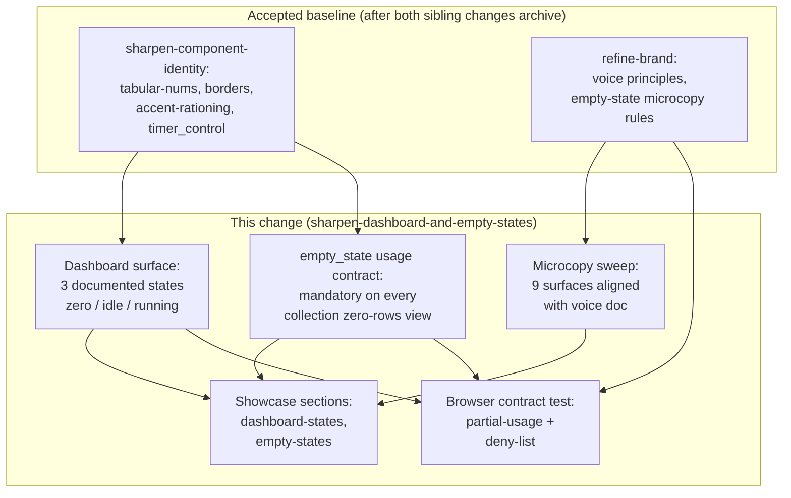

## Context

The accepted baseline already ships a correct, well-documented `empty_state` partial (`web/templates/partials/empty_state.html`, spec at `openspec/specs/ui-partials/`). Seven in-product surfaces render empty states; five already use the partial. The two non-compliant surfaces are both on the dashboard:

- `web/templates/dashboard.html:19` — "Jump back in" card renders `
Add a <a href="/clients">client</a> and a <a href="/projects">project</a> to start tracking time.
` when `.Projects` is empty. This bypasses the partial.
- `web/templates/partials/dashboard_summary.html:26` — "No billable entries yet" renders as a bespoke `
` inside the summary card. Also bypasses the partial.

The dashboard page itself is a stack of three independent cards: the timer control, the summary card-row, and the "Jump back in" list. When the workspace is genuinely empty (no projects, no entries, no running timer), the result is three mostly-empty cards competing for attention, each with its own voice — none of which orients the user toward the one action that matters ("create your first client"). The dashboard is the first screen after signup, the first screen on return, and the most-visited surface in the product. It deserves a coherent zero-state.

Two sibling changes land the grammar this design consumes:

- `sharpen-component-identity` — `tabular-nums`, two-weight border (1px rest / 2px accent), shape-language (pill actions / rectangle chips / circle presence), accent-rationing rules, timer-as-signature-object.
- `refine-timetrak-brand-and-product-visual-language` — `docs/timetrak_brand_guidelines.md` voice principles (calm, specific, billing-aware; domain nouns over productivity verbs) and empty-state microcopy patterns with 10–15 before/after examples.

Neither of those changes touches empty-state *usage* or the dashboard zero-state layout. Both defer those surfaces to a follow-on. This is that follow-on.

The partials README (`web/templates/partials/README.md`) already describes `empty_state` as canonical and specifies the `Live` flag for HTMX-delivered empties. The spec today says empty-state is *available*; it does not say it is *mandatory*. That gap is why two surfaces drift.

## Goals / Non-Goals

**Goals:**

- Make `empty_state` the only sanctioned way to render a zero-rows view anywhere in the product. Enforce via spec + browser contract test, not convention.
- Replace the dashboard's three-card empty layout with a single zero-state surface that orients a fresh user toward one primary action, and a populated-but-idle layout that lets the timer-control identity (delivered by `sharpen-component-identity`) carry the surface.
- Sweep copy on all nine empty-state consumers (seven existing + two newly migrated) against `docs/timetrak_brand_guidelines.md` voice rules. Tighten strings where they drift toward generic SaaS language.
- Add a dev-only showcase section for dashboard states and one for empty states, so reviewers can verify every variant visually without hand-constructing fixtures.

**Non-Goals:**

- Redesign of `empty_state` itself. Context keys, CSS, focus behavior, `aria-live` semantics all stay put.
- New visual grammar. Every token, border weight, numeric-text rule, and chip contract comes from `sharpen-component-identity` unchanged.
- App-wide copy audit. Only empty-state copy is in scope. Validation errors, confirmation dialogs, toasts, flash messages, button labels, and tooltips stay as-is.
- New routes, handlers, or domain logic. No migration. No new dependency.
- A "welcome tour" or onboarding checklist. The dashboard zero-state is one card with one action — not a multi-step onboarding surface.

## Decisions

### Decision 1 — The dashboard zero-state is one card, not three

**Chosen:** When the workspace has `len(Projects) == 0 && len(RecentEntries) == 0 && TimerRunning == false`, the dashboard renders exactly one `empty_state` card with title "Set up your first client and project", body describing the client → project → time-entry hierarchy in one sentence, and a single primary action linking to `/clients`. The timer control and summary card-row are **suppressed** in this state — they are meaningless without any domain data to track against.

**Alternative considered:** Keep all three cards always visible; only fix the copy. Rejected because three cards in their empty variants compete for visual weight — there is no "primary" surface, which is the whole reason the dashboard feels generic today. The zero-state is a distinct state; rendering it distinctly is the point.

**Alternative considered:** Render a multi-step checklist ("1. Create client → 2. Create project → 3. Start timer"). Rejected as generic SaaS onboarding pattern flagged in `docs/timetrak_brand_guidelines.md`. The client → project → entry hierarchy is linear and short enough that one action naturally unlocks the next; a checklist would be ceremony without payoff.

### Decision 2 — The populated-but-idle dashboard renders timer + summary, no "Jump back in"

**Chosen:** When the workspace has projects and entries but no running timer, render the timer control (in its idle identity from `sharpen-component-identity`) and the summary card-row. Remove the "Jump back in" card entirely. Its function (showing the user recent projects so they can start a timer) is better served by the timer control's own project picker, which the accepted `timer_control` spec already requires.

**Alternative considered:** Keep "Jump back in" but migrate it to use `empty_state` when `len(Projects) == 0`. Rejected because "Jump back in" only has content when projects exist, so its empty variant is unreachable under this design (Decision 1 suppresses the card entirely in zero-state). Keeping a card whose empty variant is unreachable is dead UI.

**Alternative considered:** Replace "Jump back in" with a "Recent entries" mini-list. Rejected as out of scope — that's a new surface with its own spec implications, not a sharpening pass. A future `add-dashboard-recent-entries` change can propose it on merits.

### Decision 3 — The `dashboard_summary` "No billable entries yet" fallback becomes a `u-muted` line within the existing card, not an `empty_state`

**Chosen:** The summary-card "Estimated billable this week" metric renders `—` with a `u-muted` hint line ("No billable entries yet") beneath it when `.WeekEstimatedBillable` is empty. It does NOT use `empty_state` because it is not a zero-rows *collection* view — it is a single metric with no computable value. The "empty state = zero-rows collection surface" distinction is load-bearing for Decision 4.

**Alternative considered:** Use `empty_state` for every zero-data case, including single metrics. Rejected because it makes the partial's contract fuzzy: `empty_state` has a heading and a primary action slot, both of which are wrong for a single cell in a 3-card summary. The spec delta in §specs/ makes this boundary explicit.

### Decision 4 — The new spec requirement codifies *surface* not *partial structure*

**Chosen:** The `ui-partials` delta adds a requirement shaped like "every surface that renders a collection's zero-rows view MUST delegate to `partials/empty_state`" rather than "the `empty_state` partial MUST have fields X, Y, Z" (which is already accepted baseline). This keeps the new requirement orthogonal to the existing partial-structure requirement: the partial's shape is one rule; the *obligation to use it* is a second rule.

**Alternative considered:** Encode the obligation as a code-level lint (e.g. a vet-style grep in CI). Rejected as weaker signal — linting drifts from spec. A browser contract test plus a spec requirement keeps the canonical reference in `openspec/specs/` where every future change will read it.

### Decision 5 — Microcopy sweep is bounded to nine surfaces; voice doc is the source of truth

**Chosen:** The sweep audits exactly these nine surfaces and nowhere else: the two newly-migrated (`dashboard.html`, `dashboard_summary.html`) and the seven existing (`clients/index.html`, `projects/index.html` ×2, `partials/rates_table.html`, `partials/report_empty.html`, `time/index.html`, plus showcase entries that document them). Each string is compared against `docs/timetrak_brand_guidelines.md` §Voice principles and §Empty-state microcopy patterns. Strings that already satisfy the voice rules stay as-is; `tasks.md` records which strings were edited and which were left.

**Alternative considered:** Broader sweep including validation errors and confirmations. Rejected as umbrella-adjacent — a separate `align-validation-and-confirmation-copy` change can do that work, citing the same voice doc.

### Decision 6 — Browser contract test uses negative deny-list plus positive partial-usage assertion

**Chosen:** The test asserts two things per empty-surface route:
1. **Positive:** the rendered HTML contains exactly one `.empty.card` element (the `empty_state` partial's root) within the collection region; ad-hoc `
` inside a collection wrapper is a failure.
2. **Negative:** the visible copy does not match a small deny-list of generic SaaS phrases sourced from the brand guidelines' "avoid" list: `Boost productivity`, `Get started`, `Welcome to`, `Supercharge`, `Unlock`, `Empower`. Case-insensitive, substring.

The deny-list lives in one place (`internal/e2e/browser/empty_states_test.go` as a `var bannedPhrases = [...]string{...}` with a header comment pointing to the brand guidelines section). Additions require their own change — prevents the deny-list from silently growing via test edits.

**Alternative considered:** Positive spec instead of deny-list — enumerate preferred verbs/nouns and assert at least one appears. Rejected for this change because the preferred-noun inventory does not yet exist in the brand guidelines at the granularity needed (listed as a follow-up in the proposal). Deny-list is the correct instrument for "avoid generic" today; a positive spec is the correct follow-up once the brand guidelines catalogue preferred nouns.

### Decision 7 — Showcase sections are two new files, not entries in `components.html`

**Chosen:** Add `web/templates/showcase/dashboard_states.html` (renders the dashboard surface in all three states) and `web/templates/showcase/empty_states.html` (renders every live empty-state variant). Register both in `internal/showcase/catalogue.go`.

**Alternative considered:** Append sections to the existing `web/templates/showcase/components.html`. Rejected because `components.html` is already large and its header documents it as "components" (buttons, chips, tables, forms). Dashboard states and empty-state surfaces are *surface-level* showcases, not component-level — mixing the two degrades the gallery's navigability. Matches the pattern `refine-brand` uses for its `brand` section.

## Risks / Trade-offs

- **[Risk]** Sibling changes shift scope before archiving (e.g. `sharpen-component-identity` decides to ship the dashboard-state spec itself). → **Mitigation:** implementation blocks on both siblings archiving (proposal §Assumptions). If a sibling absorbs any part of this scope before archiving, re-scope this change before `/opsx:apply`.
- **[Risk]** Suppressing the timer control on a fresh dashboard surprises users returning after deleting all projects (rare but real: a power user cleaning up). → **Mitigation:** the zero-state's single primary action links to `/clients`, which is the correct next step in both fresh-signup and post-cleanup cases. Design tested in the `dashboard_states` showcase; copy is reviewed explicitly against both scenarios.
- **[Risk]** Deny-list false positives (e.g. a future legitimate use of "Get started" in a narrowly-scoped onboarding surface). → **Mitigation:** the deny-list header comment documents the addition-requires-a-change rule; false positives surface as a review conversation, not a silent override.
- **[Risk]** The dashboard zero-state layout CSS conflicts with existing `.card-row` rules. → **Mitigation:** the new rule is scoped via a `.dashboard-empty` class, not a cascading override of `.card-row` or `.card`. Styles are additive.
- **[Trade-off]** Removing "Jump back in" reduces surface density on the populated-but-idle dashboard. Acceptable because the timer-control's project picker (accepted in `sharpen-component-identity`) covers the same need, and density-for-its-own-sake is a documented anti-pattern in the style guide.
- **[Trade-off]** The browser test's deny-list is negative rather than positive — it catches generic phrases but doesn't guarantee domain-specific ones. Acceptable as a starting point; upgrade to a positive preferred-noun assertion is listed as a follow-up once the brand guidelines catalogue preferred nouns.

## Migration Plan

- Ship templates, CSS, spec delta, showcase sections, and browser test together in one PR (the `/opsx:apply` output for this change).
- No data migration. No feature flag. No phased rollout. Rollback is a template revert — no state implications.
- After merge, the next `openspec-archive-change` folds the `ui-partials` and `ui-showcase` deltas into the baseline.

## Open Questions

- Whether the dashboard zero-state should also cover the "some projects but no entries ever" case as its own distinct layout (currently folded into the populated-but-idle branch). Will be resolved during implementation by checking the `showcase/dashboard_states.html` rendering — if the idle state reads as empty-ish with projects-but-no-entries, carve out a fourth state; otherwise leave the binary zero/idle split as designed. Either outcome stays inside this change's scope.
- Whether to emit `aria-live="polite"` on the dashboard zero-state wrapper even though the zero-state is rendered server-side, not via HTMX. Leaning yes for consistency with the partials README's live-region guidance, but the partial already handles this via its own `Live` flag. Resolved during implementation; captured in `tasks.md`.
